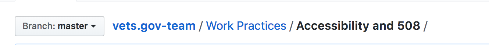

## Adding External Pages from Github API

We are going to be using Github's GraphQL API to consume markdown pages from GitHub.
This document will detail the process of adding pages and how it all works.

### Why?

We wanted a way to get pre-existing documents from GitHub without having to
duplicate it.

### How to Add External pages

I have created helper functions for the GitHub Api located in **services/github-api.js**.
We should store all our utility function for the GitHub Api here. That way we have one source of truth. We can add to this file as needed.

- getPageAndCreatePage
- getDirectoryAndCreatePages

You will need to run these functions in the **exports.sourceNodes** lifecycle hook.
This can be found in the **gatsby-node.js** file.

##### Limitations

Due to GitHub's rate limit we can only grab whole directories or single files at a time.
If we try to get the whole repo it will give us a rate limit error. This is also due to the size of our documentation repo.

##### Data you will need to make the API request

- Owner of the repo
- Repo name
- File directory you want to add or file fileName

Example:

```
department-of-veterans-affairs/vets.gov-team/Work Practices/Accessing-Staging.md
|            owner           |     repo    |           file directory           |
```

***Note***: The file directory is not the url but the actual directory.
Here is an example of what the file directory should look like:

---

**Here is how to use the utility functions:**
These functions will do an API request then create a Gatsby nodes so you can create pages within the system.

- **getPageAndCreatePage** - This will add only 1 page in Gatsby
    ```javascript
    // gatsby-node.js

    const githubApi = require('./services/github-api');

    exports.sourceNodes = async ({
      actions,
      getNode,
      hasNodeChanged,
    }) => {
      const { createNode } = actions

      await githubApi.getPageAndCreatePage({
        owner: 'department-of-veterans-affairs',
        repo: 'vets.gov-team',
        dir: 'Work Practices/Accessing-Staging.md',
      }, createNode);
    }
    ```

- **getDirectoryAndCreatePages** - This will add all markdown pages in a directory
    ```javascript
    // gatsby-node.js

    const githubApi = require('./services/github-api');

    exports.sourceNodes = async ({
      actions,
      getNode,
      hasNodeChanged,
    }) => {
      const { createNode } = actions

      await githubApi.getDirectoryAndCreatePages({
        owner: 'department-of-veterans-affairs',
        repo: 'vets.gov-team',
        dir: 'Work Practices',
      }, createNode);
    }
    ```

### How it Works

Initially we were trying to use pre-existing Gatsby plugins to do this but
couldn't find one that did what we exactly wanted it to do. The ones that came
closes to doing what we wanted ended up timing out due to the massive document repo
we have. So we ended up writing our own local plugin. Here is a list of steps we
took to make this work.

- Use Gatsby's `sourceNodes` lifecycle hook to get data.
- Use GitHub's GraphQL API to query page information from GitHub
- Create a Gatsby Node for the pages
- Use `gatsby-transformer-remark` to convert the markdown data into an html document
- Create pages using the createPages lifecycle hook.

#### Use Gatsby's `sourceNodes` lifecycle hook to get data.

First thing we have to do to get data from an API request into Gatsby is hook into the
`sourceNodes` lifecycle hook. This is were Gatsby allows you to do this.

```javascript{numberLines: true}
  // gatsby-node.js

  exports.sourceNodes = async ({
    boundActionCreators,
    getNode,
    hasNodeChanged,
  }) => {
    const { createNode } = boundActionCreators

  }
```

#### Use GitHub's GraphQL API to query page information from GitHub
Now we have to do a API request using the Github GraphQL API. You can use the [GitHub's GraphQL Explorer](https://developer.github.com/v4/explorer/) to generate your query. You'll have to explore GitHub's GraphQL API to understand more but here is a reference of how to get content data from GitHub.

[https://platform.github.community/t/query-repo-contents-with-graphql-api/1896](https://platform.github.community/t/query-repo-contents-with-graphql-api/1896)

Here is an example of what it looks like.

```javascript
// gatsby-node.js

const crypto = require('crypto');
const GithubGraphQLApi = require('node-github-graphql');
const path = require('path');

const github = new GithubGraphQLApi({
  token: process.env.GITHUB_API_KEY,
});

exports.sourceNodes = async ({
  boundActionCreators,
  getNode,
  hasNodeChanged,
}) => {
  const { createNode } = boundActionCreators

  const result = await github.query(`
    {
      repository(owner: "department-of-veterans-affairs" , name: "vets.gov-team"){
        id
        name
        object (expression: "master:Work Practices"){
          ... on Tree {
            entries {
              oid
              name
              object {
                ... on Tree {
                  entries {
                    oid
                    name
                    object {
                      ... on Blob {
                        text
                      }
                    }
                  }
                }
                ... on Blob {
                  text
                }
              }
            }
          }
        }
      }
    }
  `);
}
```

#### Create a Gatsby Node for the pages
After that we have to create a Node so that Gatsby can add it to the GraphQL data system.
There are notes in the below code which shows what is required and what is optional.
You may add custom properties that will be available in GraphQL.

```javascript
// gatsby-node.js

const crypto = require('crypto');
const GithubGraphQLApi = require('node-github-graphql');
const path = require('path');

const github = new GithubGraphQLApi({
  token: process.env.GITHUB_API_KEY,
});

exports.sourceNodes = async ({
  boundActionCreators,
  getNode,
  hasNodeChanged,
}) => {
  const { createNode } = boundActionCreators

  const result = await github.query(`
    {
      repository(owner: "department-of-veterans-affairs" , name: "vets.gov-team"){
        id
        name
        object (expression: "master:Work Practices"){
          ... on Tree {
            entries {
              oid
              name
              object {
                ... on Tree {
                  entries {
                    oid
                    name
                    object {
                      ... on Blob {
                        text
                      }
                    }
                  }
                }
                ... on Blob {
                  text
                }
              }
            }
          }
        }
      }
    }
  `);

  result
    .data
    .repository
    .object
    .entries.filter(item => item.name.endsWith('.md')).forEach(({ name, oid, object }) => {
      createNode({
        id: oid, <---- required
        parent: null, <---- required
        children: [], <---- required
        internal: { <---- required
          type: 'GithubAPI', <---- define type for look up in GraphQL
          contentDigest: crypto  <---- required
            .createHash('md5')
            .update(object.text)
            .digest('hex'),
          mediaType: 'text/markdown', <---- required
          content: object.text, <---- required
          directory: dir, <---- custom properties
          name: name.replace('.md', ''), <---- custom properties
        }
      });
    });
}
```

#### Use gatsby-transformer-remark to convert the markdown data into an html document

When we did a **createNode** we set the **mediaType: 'text/markdown'**. This will automatically convert the markdown using **gatsby-transformer-remark**.

### Create pages using the createPages lifecycle hook
After everything is set and we have all our pages in GraphQL. We can now create pages using our new data. Here is an example.

```javascript
// gatsby-node.js

result.data.allMarkDown.edges.forEach(async ({ node }) => {
  createPage({
    path: `/${node.fields.slug.toLowerCase().replace(/ /g, '-')}/`,
    component: path.resolve('./src/layouts/external-layout.js'),
    context: {
      id: node.id,
      name: node.fields.slug,
    },
  })
})
```
