# Available form features and usage guidelines

These form features are available in the VAFS library. We've provided information about how to implement them in your form.

## In this guide

- [Form instructions](#form-instructions)
- [Form footer](#form-footer)
- [Progress bar](#progress-bar)
- [Title](#title-and-subtitle)
- [Date](#date)
- [Alerts](#alerts)
- [Radio button group](#radio-button-group)
- [Checkbox group](#checkbox-group)
- [Required field](#required-field)
- [Contextual error message](#contextual-error-message)
- [Duplicate field validation](#duplicate-field-validation)
- [Conditional form fields](#conditional-form-fields)
- [Sequential duplicate form groups](#sequential-duplicate-form-groups)
- [Review page](#review-page)
- [Required checkbox before form submission](#required-checkbox-before-form-submission)
- [Remote error and event monitoring](#remote-error-and-event-monitoring)
- [Custom Submission Error](#form-submit-error)

## Form instructions

This widget allows you to provide important information, warnings, or step-by-step instructions to users before they fill out a form.

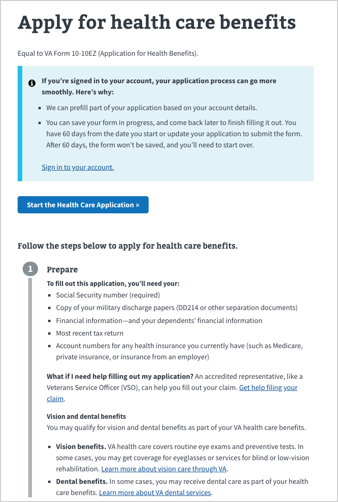

### Usage guidelines

To include the component, set the `formConfig.introduction` property to a reference to that component. Edit the JSX inside the component to change the content. For example:

```js
import Introduction from '../components/Introduction.jsx';

const formConfig = {
  …
  introduction: Introduction,
  …
};
```

## Form footer

This widget appears at the bottom of every page of a multi-page form. It is not required.

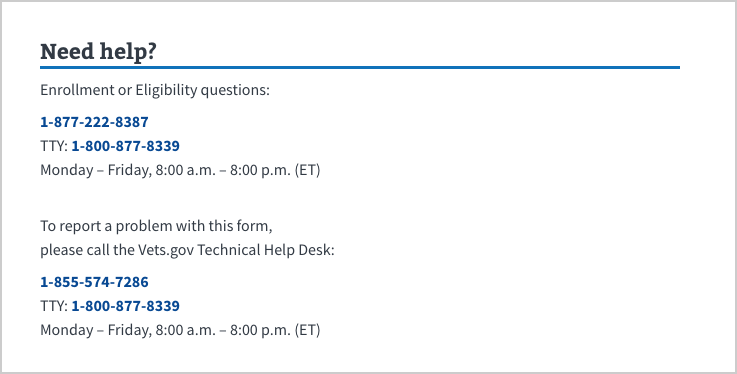

### Usage guidelines

To define footer content, create a React component that renders HTML to act as a footer. The design of this component would be very similar to the Introduction component, described earlier. For example:

```js
import Footer from '../components/Footer.jsx';
const formConfig = {
  …
  footer: Footer,
  …
};
```

For the code implementation, see [FormApp.jsx](https://github.com/department-of-veterans-affairs/vets-website/blob/master/src/js/containers/FormApp.jsx).

## Progress bar

The `SegmentedProgressBar` component calculates the number of chapters completed and displays them in a horizontal stack of blocks. It indicates to the user how much of a multi-chapter or multi-page form they've completed. It includes:

- A non-interactive, sectioned progress bar
- A number to indicate how many pages there are within each section
- The title of that section

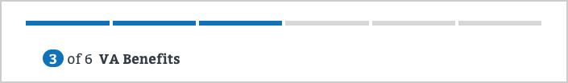

### Usage guidelines

In `formConfig`, define your form's chapters and the pages contained inside each chapter. To add a progress bar to a multi-page form, create chapters with a single page each. We don't recommend including a progress bar on single-page forms.

VAFS includes the progress bar by default, and will display automatically when the chapters and pages are defined. To remove the progress bar, edit the `FormNav.jsx` component to remove the defined `SegmentedProgressBar` in the HTML.

For the code implementation, see:

- [FormNav.jsx](https://github.com/department-of-veterans-affairs/vets-website/tree/master/src/platform/forms-system/src/js/components/FormNav.jsx)
- [SegmentedProgressBar.jsx](https://github.com/department-of-veterans-affairs/vets-website/tree/master/src/platform/forms-system/src/js/components/SegmentedProgressBar.jsx)

## Title and Subtitle

The Title and Subtitle represent the name and form number, respectively. The subtitle displays near the form title.

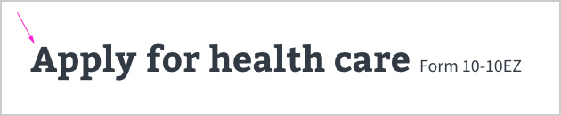

### Usage guidelines

Define the title and subtitle in `formConfig`. For example:

```js
const formConfig = {
  …
  title: 'Apply for Health Care',
  subtitle: 'Form 10-10EZ',
  …
};
```

For the code implementation, see [FormTitle.jsx](https://github.com/department-of-veterans-affairs/vets-website/tree/master/src/platform/forms-system/src/js/components/FormTitle.jsx).

## Date

Defines a date picker with validations.

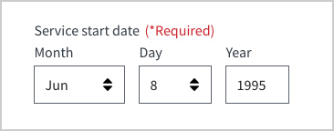

### Usage guidelines

Define these fields in the `schema` and then reference them in the `uiSchema`. These date field definitions are available:

- [date.js](https://github.com/department-of-veterans-affairs/vets-website/tree/master/src/platform/forms-system/src/js/definitions/date.js)
- [dateRange.js](https://github.com/department-of-veterans-affairs/vets-website/tree/master/src/platform/forms-system/src/js/definitions/dateRange.js)
- [currentOrPastDate.js](https://github.com/department-of-veterans-affairs/vets-website/tree/master/src/platform/forms-system/src/js/definitions/currentOrPastDate.js)
- [monthYear.js](https://github.com/department-of-veterans-affairs/vets-website/tree/master/src/platform/forms-system/src/js/definitions/monthYear.js)
- [monthYearRange.js](https://github.com/department-of-veterans-affairs/vets-website/tree/master/src/platform/forms-system/src/js/definitions/monthYearRange.js)

For example:

```js
import currentOrPastDate from '../definitions/currentOrPastDate.js';
const formConfig = {
  …
  schema: {
    type: 'object',
    required: [ 'serviceDate' ],
    properties: {
      serviceDate: 'string'
    }
  },
  uiSchema: {
    serviceDate: currentOrPastDate('Service Date'),
  }
  …
};
```

## Alerts

Alerts are included automatically in fields that include validation. Taken from USWDS, alerts appear in several color variations, with or without icons, to indicate a warning, an error, or contextual information.

### Usage guidelines

For examples of how alerts are used, see https://github.com/department-of-veterans-affairs/vets-website/tree/master/src/js/widgets.

## Radio button group

A group of options where the user can only select a single item.

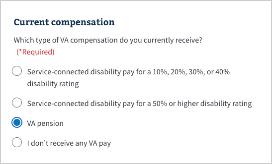

### Usage guidelines

The data for a group of radio buttons is similar to the data for a select field (i.e., `string` type with an `enum` property), which means the `SelectWidget` will be rendered by default.

To override the `SelectWidget`, pass `'ui:widget': 'radio'` to your `uiSchema` for that field. To specify different label text for each option, pass `'ui:options'` to `uiSchema`.

Your config for a question where the answer is selected from a group of radio buttons might look like this:

```js
schema: {
  type: 'object',
  properties: {
    favoriteAnimal: {
      type: 'string',
      enum: ['dog', 'cat', 'octopus', 'sloth']
    }
  }
},
uiSchema: {
  'ui:widget': 'radio',
  'ui:options': {
    labels: {
      dog: 'Dog',
      cat: 'Cat',
      octopus: 'Octopus',
      sloth: 'Sloth'
    }
  }
}
```

For the code implementation, see [RadioWidget](https://github.com/department-of-veterans-affairs/vets-website/tree/master/src/platform/forms-system/src/js/widgets/RadioWidget.jsx).

## Checkbox group

A group of options where the user can select multiple items.

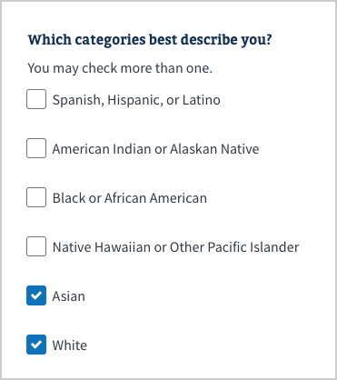

### Usage guidelines

Each individual checkbox is used to store `boolean` data. To include a group of checkboxes, include separate fields for each checkbox, with `type: 'boolean'` passed to the `schema`.

Your config for a group of checkboxes might look like this:

```js
schema: {
  type: 'object',
  properties: {
    'view:booksRead': {
      type: 'object',
      properties: {
        hasReadPrideAndPrejudice: { type: 'boolean' },
        hasReadJaneEyre: { type: 'boolean' },
        hasReadGreatGatsby: { type: 'boolean' },
        hasReadBuddenbrooks: { type: 'boolean' }
      }
    }
  }
},
uiSchema: {
  'view:booksRead': {
    'ui:title': 'Which books have you read?',
    'ui:description': 'You may check more than one.',
    hasReadPrideAndPrejudice: {
      'ui:title': 'Pride and Prejudice by Jane Austen'
    },
    hasReadJaneEyre: {
      'ui:title': 'Jane Eyre by Charlotte Brontë'
    },
    hasReadGreatGatsby: {
      'ui:title': 'The Great Gatsby by F. Scott Fitzgerald'
    },
    hasReadBuddenbrooks: {
      'ui:title': 'Buddenbrooks by Thomas Mann'
    }
  }
}
```

For the code implementation, see [CheckboxWidget](https://github.com/department-of-veterans-affairs/vets-website/tree/master/src/platform/forms-system/src/js/widgets/CheckboxWidget.jsx).

## Required field

Require any field. Validation is included.

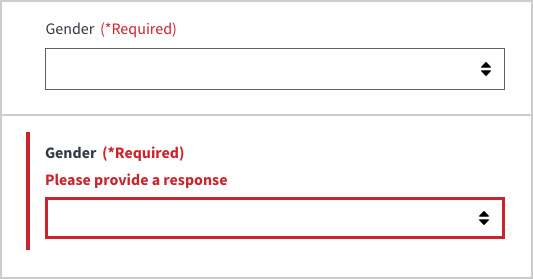

### Usage guidelines

For information on requiring fields or components, see "[About the schema and uiSchema objects](./about-the-schema-and-uischema-objects.md)."

## Contextual error message

This indicates to the user that they have either not filled out a required field or they have not done so within the form's parameters. You can set a custom error message to help the user progress with the form.

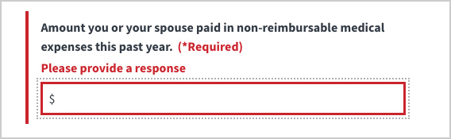

### Usage guidelines

There are several ways that form fields can be invalid, such as a required field is blank, the entry is too short or long, or the entry does not satisfy a specific format.

- **To show an error on a blank field that is required**, include the field in the array under the `required` property in the `schema`. An error on that field will automatically be rendered if the field is blank.
- **To show an error on a field for any other reason** (e.g., it has not met certain data requirements), pass a validation function to the array for the `ui:validations` property under that field in `uiSchema`.

The error message that is displayed can either be a default message or one that you specify. There are several [default error messages](https://github.com/department-of-veterans-affairs/vets-website/tree/master/src/platform/forms-system/src/js/validation.js) for different situations.

To show a custom error message, add the message to the `ui:errorMessages` object in the `uiSchema` as a key value pair:

- The key is the `schema` property that the data is in violation of (e.g., the entry doesn't match the requirements of the `pattern` property).
- The value is the text of the error message.

When you include multiple messages in the `ui:errorMessages` object, they will be evaluated in order.

Your config file may look like this:

```js
schema: {
  type: 'object',
  required: ['ssn'],
  properties: {
    ssn: {
      type: 'string',
      pattern: '^[0-9]{9}$'
    }
  }
},
uiSchema: {
  ssn: {
    'ui:widget': SSNWidget,
    'ui:title': 'Social Security number',
    'ui:validations': [
      validateSSN
    ],
    'ui:errorMessages': {
      required: 'Please enter your SSN',
      pattern: 'Please enter a valid 9 digit SSN (dashes not allowed)'
    }
  }
}
```

## Duplicate field validation

This feature validates that a user has correctly entered duplicate data in two fields.

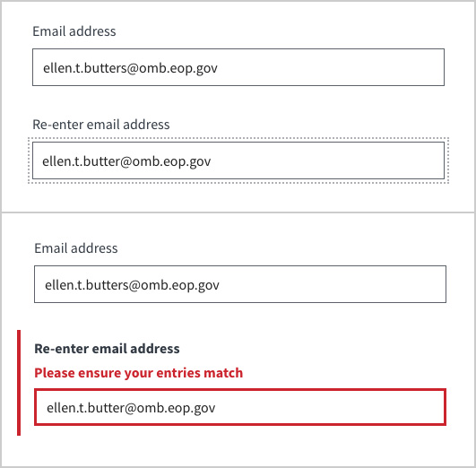

### Usage guidelines

For more information, see "[Validating a field based on other fields in the same object](./common-patterns-for-building-forms.md#validating-a-field-based-on-other-fields-in-the-same-object)."

## Conditional form fields

You can set follow up questions to appear only if the user answers a form question a particular way.

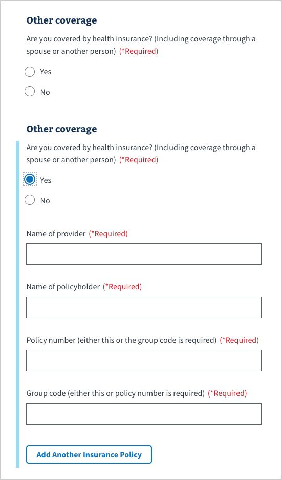

### Usage guidelines

There are 2 fields you can use to conditionally expand a form field:

- `expandUnder`: This property takes the name of the other field upon which your field is shown.
- `expandUnderCondition`: This property takes 1 of 2 values:
- The answer to the other field that would satisfy the condition to show your field. If the other field takes boolean data, your field will automatically be shown if the answer to the other field is `true`, so there is no need to include `expandUnderCondition: true` in that case. However, if the other field takes any other type of data, you will need to include `expandUnderCondition`.
- A function that receives the data from the `expandUnder` field as an argument.

Both fields are nested under the `ui:options` property in the `uiSchema`.

The `expandUnder` and `expandUnderCondition` properties are distinctly separate from the `depends` property, which conditionally shows entire pages of the form. For more information, see "[Conditionally excluding a page](./common-patterns-for-building-forms.md#conditionally-including-a-page)."

Your config file might look like this:

```js
{
  schema: {
    type: 'object',
    properties: {
      hasPet: {
        type: 'boolean'
      },
      petName: {
        type: 'string'
      }
    }
  },
  uiSchema: {
    hasPet: {
      'ui:title': 'Do you have a pet?'
      'ui:widget': 'yesNo'
    },
    petName: {
      'ui:title': 'What is your pet‘s name?',
      'ui:options': {
        expandUnder: 'hasPet',
        expandUnderCondition: true
      }
    }
  }
}
```

For the code implementation, see [helpers.js](https://github.com/department-of-veterans-affairs/vets-website/tree/master/src/platform/forms-system/src/js/state/helpers.js).

## Sequential duplicate form groups

Use this feature to collect multiple items with the same form questions, such as addresses in a time period, jobs in a time period, or employment in a time period.

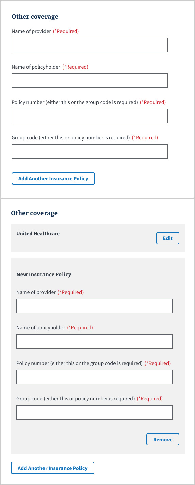

### Usage guidelines

To display multiple groups of the same form questions, define the data in the `schema` as `type: 'array'`, with each group of questions as an `item` in that `array`. The `schema` and `uiSchema` for the group of questions within the `items` object is structured the same as other fields.

Your config file might look like this:

```js
{
  schema: {
    type: 'object',
    properties: {
      dogs: {
        type: 'array',
        items: {
          type: 'object',
          properties: {
            nameOfDog: { type: 'string' },
            age: { type: 'string' },
            breed: { type: 'string' }
          }
        }
      }
    }
  },
  uiSchema: {
    'ui:title': 'How many dogs do you have?',
    items: {
      nameOfDog: { 'ui:title': 'What is your dog‘s name?' },
      age: { 'ui:title': 'How old is your dog?' },
      breed: { 'ui:title': 'What is your dog‘s breed?' }
    }
  }
}
```

## Review page

When you build a form with more than one chapter (shown by the segments in a progress bar), the review page lets a user edit all of their entered form data without having to go back one page at a time.

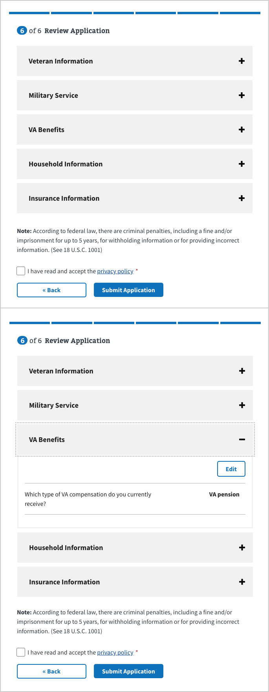

### Usage guidelines

The review page renders the form data in review mode automatically. However, you can pass some specific options to the form config to customize some review features.

This property is nested directly under `uiSchema`:

- `'ui:reviewWidget'`: takes a widget component to render on the review page for that field. Default review widgets are automatically rendered, so only use this if you need to customize the review widget that is used.
- `'ui:reviewField'`: allows a custom review component to be built for each field on the review page. It is given the result of the `'ui:reviewWidget'` within the `children` parameter, so this value must be rendered within the custom function.

These properties are nested under `uiSchema: { 'ui:options': {} }`:

- `hideOnReview`: Hides the field on the review page; takes a `boolean`
- `hideOnReviewIfFalse`: Hides the field on the review page when the field value is `false`; takes a `boolean`
- `keepInPageOnReview`: By default, array fields that are displayed on a single page in a form, such as information for multiple dependents, are displayed in a separate section on the review page. To keep the information in a single section on a review page, set this property.
- `hideEmptyValueInReview`: Hides the review row (e.g. "Street address 3") if the form data is an empty string, `null` or `undefined`. This option does not work if a custom `'ui:reviewField'` is controlling the review output.

For the code implementation, see the [review folder](https://github.com/department-of-veterans-affairs/vets-website/tree/master/src/platform/forms-system/src/js/review).

## Required checkbox before form submission

Use this feature to require a user to agree they have read terms and conditions, a privacy policy, or any other text before submitting your form. It includes a checkbox and short-form text that can include relevant links to additional information on separate pages.

To configure this feature, place a `preSubmitInfo` object in the `formConfig`. These are the available options:

| Option          | Description                                                                                                                                                                                                                                                                                  | Required               |
| --------------- | -------------------------------------------------------------------------------------------------------------------------------------------------------------------------------------------------------------------------------------------------------------------------------------------- | ---------------------- |
| CustomComponent | A React element that will replace the default [`PreSubmitSection`](https://github.com/department-of-veterans-affairs/vets-website/blob/f6a5a742b870869550ab2f5af72428353a5a89da/src/platform/forms-system/src/js/components/PreSubmitSection.jsx#L5) component.                              | false                  |
| error           | A text string or React element displayed as an error message if the user attempts to submit the form without checking the checkbox.                                                                                                                                                          | false                  |
| field           | The name of the form field for the required checkbox. This field has the value `true` in the submitted form data.                                                                                                                                                                            | true                   |
| label           | A text string or React element that labels the checkbox.                                                                                                                                                                                                                                     | true                   |
| notice          | A text string or [React element](https://reactjs.org/docs/rendering-elements.html) placed above the checkbox and submit button. If the form definition file is `.jsx` the definition can be inline, or use `import` to reference an external component. If not specified, no notice appears. | false, but recommended |
| required        | When `true`, a checkbox and label appear above the submit button. The user must check the box before submitting the form. When `false` or not specified, the `field`, `label`, and `error` options are not used.                                                                             | false                  |

This is an example of `preSubmitInfo`:

```js
preSubmitInfo: {
  required: true,
  field: 'privacyAgreementAccepted',
  label: <span>I have read and accept the <a href="/privacy">privacy policy</a>.</span>,
  error: 'You must accept the privacy policy before continuing',
  CustomComponent: CustomPreSubmitComponent
}
```

### Default `PrivacyAgreement`

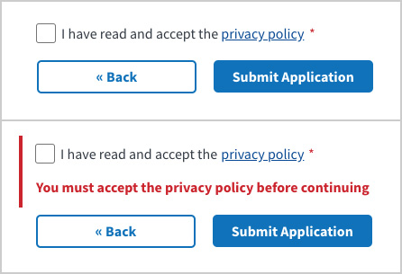

### `CustomComponent` example

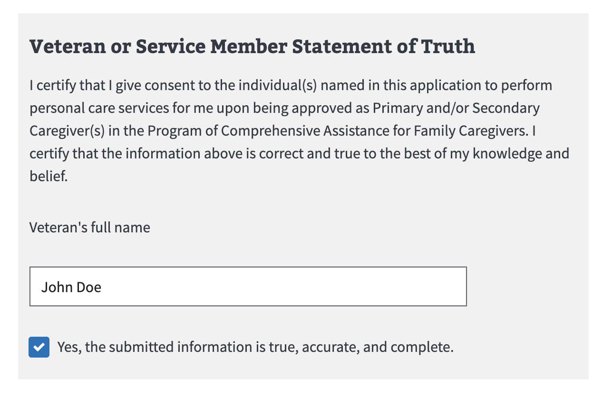

### Usage guidelines

- If you don't specify a **preSubmitInfo**, no notice or checkbox appears above the submit button. Most applications will want to give some sort of notice to the user before they submit the form. Although this section is optional, we recommend you specify it.

- For the **code implementation**, see [PreSubmitSection](https://github.com/department-of-veterans-affairs/vets-website/tree/master/src/platform/forms-system/src/js/components/PreSubmitSection.jsx) and [SubmitController](https://github.com/department-of-veterans-affairs/vets-website/tree/master/src/platform/forms-system/src/js/review/SubmitController.jsx).

#### `CustomComponent` props

| Prop              | Description                                                                                                                                                                                                                                        | Required |
| ----------------- | -------------------------------------------------------------------------------------------------------------------------------------------------------------------------------------------------------------------------------------------------- | -------- |
| formData          | Data object containing the form’s data so your `CustomComponent` can be reactive to form changes                                                                                                                                                   | false    |
| preSubmitInfo     | Data object, See table above                                                                                                                                                                                                                       | false    |
| onSectionComplete | Is a function, provided by `PreSubmitSection`, which expects a single boolean parameter indicating when all conditions of your `preSubmitInfo.CustomComponent` are met. Until `onSectionComplete` is called with `true`, the form will not submit. | true     |
| showError         | Boolean to toggle errors, errors can also be handled internally                                                                                                                                                                                    | false    |

## Remote error and event monitoring

If you provide a function for `formConfig.recordEvent`, the library calls that function when notable events occur. If you do not provide a function, the library logs these events onto the browser console.

The `recordEvent` function receives a single object that can contain different information depending on the kind of event being reported. Events reported by the library always have a `event` property that is a string describing the event. The events currently supported by the library are:

- **validation-failed-on-submit**: This is likely an error in the form definition or a React component, since the form should be completely validated at this point.
- **form-submit-pending**: An informational message showing that the user has pressed the submit button, and that the form has validated and been sent to the server.
- **form-submit-successful**: The server returned a status indicating it has accepted the form.
- **form-submit-error**: The form was submitted, but the server didn't accept the submission. The object contains an `error` and `errorType` with more information about the nature of the error.

Other events may be added in the future. This `recordEvent` logs events to Google Analytics, except for pending/successful form submits which are filtered out:

```js
formConfig = {
  ...
  // The Google Analytics code snippet loads in the main document
  // https://developers.google.com/analytics/devguides/collection/analyticsjs/
  recordEvent: data => {
    // Don't log if GA is not (yet) loaded or if this is a form success/pending
    if (!window.dataLayer ||  /^form-submit-(successful|pending)$/.test(data.event)) {
      return;
    }
    return window.dataLayer.push(data);
  },
  ...
};
```

## Form Submission Error

Web applications can fail for many reasons, including bad Internet connections, outdated browsers, and misbehaved browser extensions. Even if you test thoroughly, users may experience frustrating errors that they do not or cannot report. We highly recommend that you use an error-reporting and/or event-reporting service to track the use of your forms. Examples of services that could be used are Google Analytics, Errorception, Sentry, Airbrake, and Raygun.

### Default Submission Error

This is the default custom error message on every form, and looks as follows:
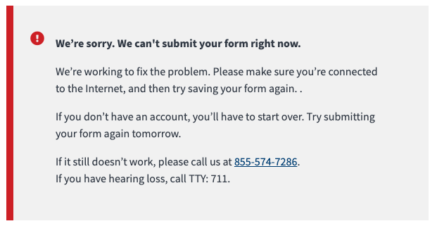

#### Usage guidelines

The default component is rendered by not having a key value pair for `submissionError` in the form config

This component has optional dialog based on whether the user is signed in or not, and has an options for additional dialog.example

For implementation details the internal code is found here [DefaultErrorMessage](https://github.com/department-of-veterans-affairs/vets-website/blob/d622923e4879098562f52dc0ef4f8accda8d359d/src/platform/forms/save-in-progress/RoutedSavableReviewPage.jsx#L85)

### Custom Submission Error

If your form requires a more custom error message you can pass in a custom component that returns a [DSVA Alertbox](https://department-of-veterans-affairs.github.io/veteran-facing-services-tools/visual-design/components/alertbox/)

#### Usage guidelines

First you will need a component that returns a AlertBox might look something like this:

```js
const SubmitError = () => {
  const ErrorBody = () => {
    return (
      <div>
        <h2 className="vads-u-font-size--h4">What you can do</h2>

        <p>
          If you feel you’ve entered your information correctly, please call the{' '}
          <a href="https://www.va.gov/">VA.gov</a> help desk at{' '}
          <a href="tel:8555747286">855-574-7286</a>
          (TTY: 711). We’re here Monday-Friday, 8:00 a.m.-8:00 p.m. ET.
        </p>
      </div>
    );
  };

  return (
    <AlertBox
      headline="We can’t process your electronic application."
      content={ErrorBody()}
      status="error"
    />
  );
};
};
```

Then add it to your formConfig as follows:

```js
formConfig = {
  ...
    submissionError: SubmitError,
  ...
};
```

Once you fill out your form and submit incorrect data, your output will looking something like this:
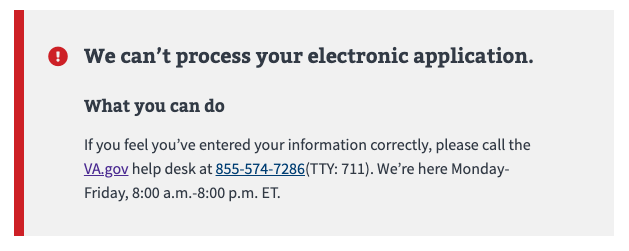

##### VSP Approval for Custom Error message

<!-- TODO: uncomment this once PR bot has been implimented -->
<!-- When you open a PR with this custom SubmitError the VSP review bot will tag your PR for VSP approval. -->

Custom error messages will require explicit approval from VSP content & design.

This can be flagged during a regular collaboration cycle review (ie. "please note that this error message would override the default forms system error message on this form") or can be tagged in the DSVA slack in the `#vfs-platform-support` channel
