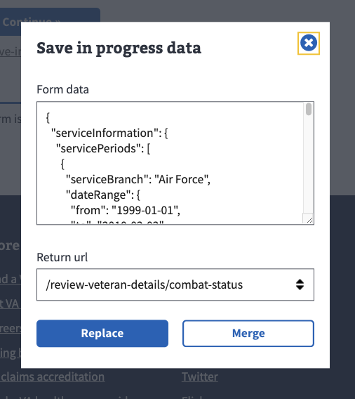
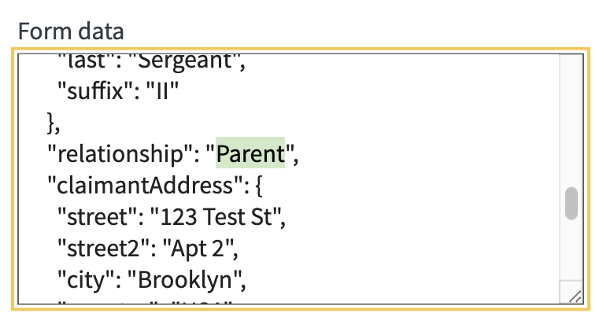
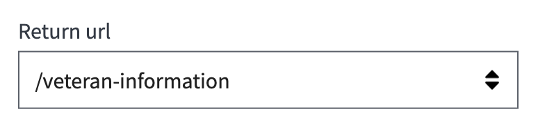
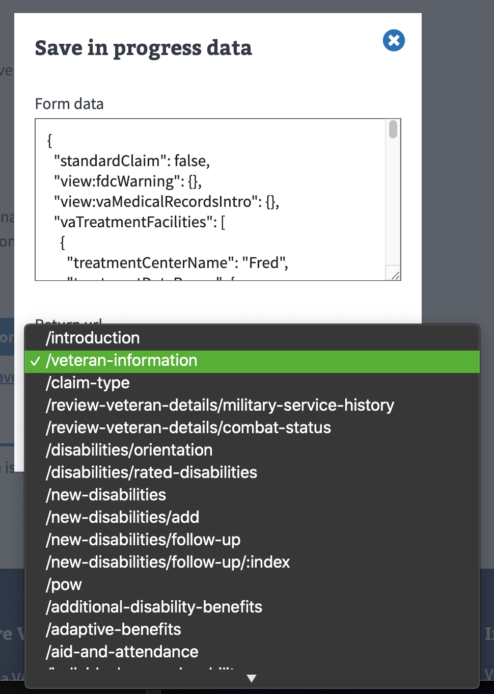

# Using the Save in Progress menu

Previous: [Setting up Save in Progress](/forms/save-in-progress)

Many of our VA forms are long and it takes a long time when you need to fill
in the form every time you have to review or assessment a specific page.

Sadly, not every application includes a form, e.g. claim status tool. You won't
see this save-in-progress menu or link show up on those pages.

This save-in-progress menu will allow you to:
- [Using the Save in Progress menu](#using-the-save-in-progress-menu)
  - [Activating & Deactivating](#activating--deactivating)
    - [Activate](#activate)
    - [Deactivate](#deactivate)
  - [Buttons](#buttons)
    - [Close](#close)
    - [Replace versus merge button](#replace-versus-merge-button)
      - [Replace](#replace)
      - [Merge](#merge)
    - [Copy and paste in predefined form data](#copy-and-paste-in-predefined-form-data)
    - [Edit the data without being on a specific page](#edit-the-data-without-being-on-a-specific-page)
    - [Add missing data without needing to include all the form data](#add-missing-data-without-needing-to-include-all-the-form-data)
  - [Return url](#return-url)
    - [Jump to a specific page within the form](#jump-to-a-specific-page-within-the-form)



Scenarios:
- You have a user that doesn't have specific mock data available. Open this
  menu and add the new data; For example, for form 526, some mock users don't
  include pre-existing rated disabilities. This menu will allow you to enter
  some rated disabilities and open up that branch of the form.
- If you need to let a developer know about an issue on a certain page within a
  form, screenshots help, but it will still take the developer time to locate
  the page and test any changes that were made. Share the form data you entered,
  and the page url with the developer, and they can easily navigate to that
  page. You'll also be able to use that same data to later return to the page to
  verify the changes.
- A developer asks you for advice on how to fix, modify or give feedback on the
  implementation or content of a specific page. They have shared the form data
  and url to that page. You can go to the form,
- You already have all the form data in place, but you need to exam a certain
  page near the end of the form. Open the menu and choose a destination page
  anywhere within the form.

## Activating & Deactivating

This save-in-progress menu and link doesn't show up automatically. You will
need to activate it. This was made to be super-easy!

### Activate

If you don't see the "Open save-in-progress menu" link:

- Focus in the browser url
- Add or replace the hash (`#` is also known as the page anchor) content. The
  required hash will look like this - `#dev-on` - add it to the end of the url
- Press <kbd>Enter</kbd> on the keyboard. The link will immediately show up.


### Deactivate

To hide the link:

- Focus in the browser url
- Add or replace the hash (`#` is also known as the page anchor) content. The
  required hash will look like this - `#dev-off` - add it to the end of the url
- Press <kbd>Enter</kbd> on the keyboard. The link will immediately dissapear.
  If the menu is open, it will also disappear, but may automatically reappear
  if immediately re-activated.


## Buttons

### Close

To close and cancel any changes within the save-in-progress menu, use the "x"
button in the upper right corner, or by pressing the <kbd>Esc</kbd> key.

Using the "Replace" or "Merge" button will save any changes within the save-in-
progress menu _and_ close the menu.

### Replace versus merge button

At the bottom of the save-in-progress menu are two buttons: "Replace" and
"Merge".


#### Replace

The replace button will completely replace the existing form data with whatever
new form data is added into the textarea. If only a small portion of the form
data was added into the textarea, the form data may be missing some fields and
may cause errors.

This is likely the button that is used the most.

#### Merge

The merge button will combine either a small part of the form data into the
complete data, i.e. merge a partial bit of data into the full data set. A more
specific example is shared in the [add missing data without needing to include
_all_ the form data](#add-missing-data-without-needing-to-include-all-the-form-data) section.

### Copy and paste in predefined form data

Most forms include a `maximal-test.json` file for testing. Copy the content of
this file and paste it into the menu form data (as-is) to apply this data
(current as of July 2020; some of these forms may not be in production):

- [burials](https://github.com/department-of-veterans-affairs/vets-website/blob/master/src/applications/burials/tests/schema/maximal-test.json)
- [disability-benefits/686](https://github.com/department-of-veterans-affairs/vets-website/blob/master/src/applications/disability-benefits/686/tests/schema/maximal-test.json)
- [disability-benefits/996](https://github.com/department-of-veterans-affairs/vets-website/blob/master/src/applications/disability-benefits/996/tests/fixtures/data/maximal-test.json)
- [disability-benefits/all-claims](https://github.com/department-of-veterans-affairs/vets-website/blob/master/src/applications/disability-benefits/all-claims/tests/fixtures/data/maximal-test.json)
- [disability-benefits/bdd](https://github.com/department-of-veterans-affairs/vets-website/blob/master/src/applications/disability-benefits/all-claims/tests/fixtures/data/maximal-bdd-test.json)
- [edu-benefits/10203](https://github.com/department-of-veterans-affairs/vets-website/blob/master/src/applications/edu-benefits/10203/tests/schema/maximal-test.json)
- [edu-benefits/0993](https://github.com/department-of-veterans-affairs/vets-website/blob/master/src/applications/edu-benefits/tests/0993/schema/maximal-test.json)
- [edu-benefits/0994](https://github.com/department-of-veterans-affairs/vets-website/blob/master/src/applications/edu-benefits/tests/0994/schema/maximal-test.json)
- [edu-benefits/1990](https://github.com/department-of-veterans-affairs/vets-website/blob/master/src/applications/edu-benefits/tests/1990/schema/maximal-test.json)
- [edu-benefits/1990e](https://github.com/department-of-veterans-affairs/vets-website/blob/master/src/applications/edu-benefits/tests/1990e/schema/maximal-test.json)
- [edu-benefits/1990n](https://github.com/department-of-veterans-affairs/vets-website/blob/master/src/applications/edu-benefits/tests/1990n/schema/maximal-test.json)
- [edu-benefits/1995](https://github.com/department-of-veterans-affairs/vets-website/blob/master/src/applications/edu-benefits/tests/1995/schema/maximal-test.json)
- [edu-benefits/5490](https://github.com/department-of-veterans-affairs/vets-website/blob/master/src/applications/edu-benefits/tests/5490/schema/maximal-test.json)
- [edu-benefits/5495](https://github.com/department-of-veterans-affairs/vets-website/blob/master/src/applications/edu-benefits/tests/5495/schema/maximal-test.json)
- [edu-benefits/feedback](https://github.com/department-of-veterans-affairs/vets-website/blob/master/src/applications/edu-benefits/tests/feedback-tool/schema/maximal-test.json)
- [hca](https://github.com/department-of-veterans-affairs/vets-website/blob/master/src/applications/hca/tests/schema/maximal-test.json)
- [pensions](https://github.com/department-of-veterans-affairs/vets-website/blob/master/src/applications/pensions/tests/schema/maximal-test.json)
- [pre-need](https://github.com/department-of-veterans-affairs/vets-website/blob/master/src/applications/pre-need/tests/schema/maximal-test.json)
- [veteran-representative](https://github.com/department-of-veterans-affairs/vets-website/blob/master/src/applications/veteran-representative/tests/schema/maximal-test.json)
- [vre/chapter31](https://github.com/department-of-veterans-affairs/vets-website/blob/master/src/applications/vre/tests/chapter31/schema/maximal-test.json)
- [vre/chapter36](https://github.com/department-of-veterans-affairs/vets-website/blob/master/src/applications/vre/tests/chapter36/schema/maximal-test.json)

**Note**:

- To copy the `maximal-test.json` it is easiest to click on the "Raw" button at
  the top of the file block, then use <kbd>Ctrl</kbd> or <kbd>&#x2318;</kbd> plus <kbd>a</kbd> to select all the
  content; then use <kbd>Ctrl</kbd> or <kbd>&#x2318;</kbd> plus <kbd>c</kbd> to copy the selected text.
- To paste in the clipboard contents, use <kbd>Ctrl</kbd> or <kbd>&#x2318;</kbd> plus <kbd>v</kbd>.
- After pasting in the complete form data into the textarea, use the "Replace" button to completely replace the form data. Using "Merge" would also
work, but may not remove unrelated data.

### Edit the data without being on a specific page

Within the save-in-progress menu, the textarea containing the "Form data" is editable. This would allow you to edit data in-place



Edit the value, then use the "Replace" button.

### Add missing data without needing to include all the form data

For example, if you only want to update the "relationship" field, even without
being on that page, add the following snippet:

```json
{
  "relationship": "Parent"
}
```

Then use the "Merge" button to combine this snippet with the complete form data.

## Return url

This is a select dropdown that is populated with the form's active pages.

Please be aware that the dropdown won't immediately update after modifying the
form data textarea. You'll need to use "Replace" which closes &amp; restarts the
form, then continue the form and open the menu a second time. Set the target
page and use the "Replace" button again. This isn't ideal, but it'll work until
a more optimal solution is found.



### Jump to a specific page within the form

- The select will only show the active pages based on the choices in the form
  data.
- The select won't update until the new form data has been applied.
- **NOTE** If you ever encounter a situation where the form keeps restarting,
  it may be that the target url may not be a valid destination. You may have to
  restart the form to fix this problem.



Next: [Forms in production](/forms/forms-in-production)
