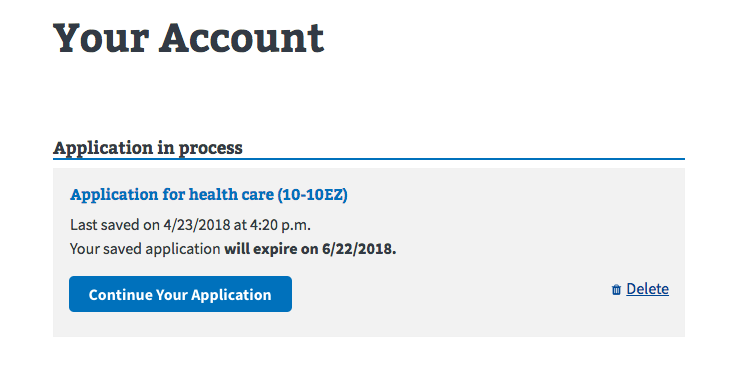

# Setting up Save in Progress

Previous: [Advanced tutorial](/forms/form-tutorial-advanced)

Forms on VA.gov support the ability to save them while in progress to a user's account and resume them later. Enabling Save in Progress requires

- Configuring naming and messaging options in the **form config**.
- Making the Save In Progress form retrievable on the **user profile** page.
- Adding links to the Save In Progress on **static pages**.

## Form config

There are several configuration options related to Save in Progress (SiP).

```js
const formConfig = {
  formId: '1010ez',
  version: 0,
  prefillEnabled: true,
  savedFormMessages: {
    notFound: 'Please start over to apply for health care.',
    noAuth: 'Please sign in again to resume your application for health care.'
  },
  ...
}
```

This is from our health care application. The most important piece of information is `formId`, which is the key that will be used to save the form data on the backend. Once you choose this, you can't change it in production. We also set a version, typically to 0, which can be incremented if you need to migrate form data in production.

There are also a couple of messages you can set, which show up in various places on the form (primarily on the intro page).

## User profile

You will also need to make a couple changes in the user profile code, so that your form can show up in the list of saved forms on the account page. In `src/applications/personalization/dashboard/helpers.jsx`, you should add your form to the four configuration objects: `formBenefits`, `formLinks`, `trackingPrefixes`, and `sipEnabledForms`. The information for each of these should be in your form config file.

## Static pages

Your form will likely be linked somewhere in the static content for VA.gov. In those places, we have the ability to replace something like an "Apply now" button with a widget to resume or start over an in progress form.

In your content page, you can add front matter to set up a widget:

```yaml
widgets:
  - root: react-applicationStatus
    timeout: 20
    loadingMessage: Checking your application status.
    errorMessage: <strong>We’re sorry. Something went wrong when we tried to load your saved application.</strong<br/>Please try refreshing your browser in a few minutes.
```

And somewhere in the file, where you want the widget to show up:

```html
<div id="react-applicationStatus" class="static-page-widget" data-widget-type="health-care-app-status">
  <a class="usa-button-primary va-button-primary" href="/health-care/apply/application/">Apply for Health Care Benefits</a>
</div>
```

Note that the id matches the `root` property in the front matter. This is the link that will show up will the Javascript code is loading or if it fails to load.

Also note the `data-widget-type` property. You'll need make that custom for your form and add it to the list in `src/applications/static-pages/widgetTypes.js`.

Once that's done, you can open up the static pages entry file at `src/applications/static-pages/static-pages-entry.js` and make your changes. Here's an example for the healh care application:

```js
createApplicationStatus(store, {
  formId: '1010ez',
  additionalText: 'You can start your online application right now.',
  applyLink: '/health-care/apply/',
  applyText: 'Apply for Health Care Benefits',
  widgetType: widgetTypes.HEALTH_CARE_APP_STATUS,
});
```

The main things to note are that the `widgetType` should match the one you added to the widget types list. The code block also has some configuration options for your form that should be easy to get from the form config object.

**Note:** An analytics event is added to the form introduction page by default. To finish setting it up, add an analytics event name to `gaStartEventName` property of the [`SaveInProgressIntro`](https://github.com/department-of-veterans-affairs/vets-website/blob/master/src/platform/forms/save-in-progress/SaveInProgressIntro.jsx) component, which is used on `IntroductionPage`:

```html
<SaveInProgressIntro
  gaStartEventName="my-start-form-event-name"
  ...
/>
```

Once you've got all that set up, your form should appear on the profile page:



Next: [Using the Save in Progress menu](/forms/save-in-progress-menu)
