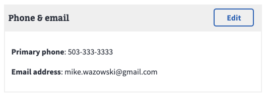
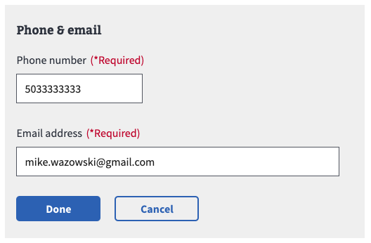

# Using available fields

## In this guide

- [Using the `ReviewCardField`](#using-the-revewcardfield)

## Using the ReviewCardField

### What does it do?

The `reviewCardField` is used as a wrapper around user data that _shouldn't_ need to be modified. It is currently being used to group user data such as:

- Phone & email
- Contact information (home or mailing address)
- Bank account information

If the data is preloaded, it will appear on the page in a collapsed form with an edit button. This allows the user to review and make changes as needed.



With missing prefill data, or when the user presses the "Edit" button, the card will enter edit mode showing the form components




### How do I use it in a form?


#### Importing

First make sure to import the component along with your view component (more on this below)

```js
// The review card field
import ReviewCardField from 'platform/forms-system/src/js/components/ReviewCardField';
// review mode renderer
import myViewComponent from './myViewComponent';
// predefined uiSchemas
import phoneUI from 'platform/forms-system/src/js/definitions/phone';
import emailUI from 'platform/forms-system/src/js/definitions/email';
```

#### `myViewComponent`

This component renders the form data when the `ReviewCardField` is in review (not edit) mode. For example:

```js
// myViewComponent.jsx

const formatPhoneNumber = number => {
  // formatting magic done here
  return number;
}

export const myViewComponent = ({ formData }) => {
  const { phone, emailAddress } = formData;
  return (
    <>
      <p>
        <strong>Phone number</strong>
        {formatPhoneNumber(phone) || 'Not available'}
      </p>
      <p>
        <strong>Email address</strong>
        {emailAddress || 'Not available'}
      </p>
    </>
  );
};
```

### `uiSchema`

- Set `'ui:field'` to `ReviewCardField`
- Set `'ui:options` `viewComponent` to your custom `myViewComponent`
- Include the desired uiSchema for the form elements

```js
contactInfo: {
  'ui:title': 'Contact Information',
  phoneEmailCard: {
    'ui:title': 'Phone & email',
    'ui:field': ReviewCardField,
    'ui:options': {
      // showing ALL options
      // ** required **
      viewComponent: myViewComponent,
      // ** optional **
      reviewTitle: 'New Title',
      editTitle: 'Editing...',
      startInEdit: false,
      volatileData: false,
      itemName: 'Name',
    },
    phone: phoneUI('Home phone'),
    emailAddress: emailUI(),
  },
},
```

#### `ReviewCardField` options

- `viewComponent` - Component shown in review (non-edit) mode. It gets the same `formData` as the field.
- `startInEdit` - Set as either a function or a (boolean) value that will be evaluated as truthy or not. If a function is used, it's passed the formData and expects a boolean return value.
- `volatileData` - If this is truthy, the component pattern changes slightly so only completely new data can be entered, but not edited. This is useful for bank account information.
- `reviewTitle` - The title shown on the review card. Defaults to `'ui:title'`
- `editTitle` - The title shown on the edit card. Defaults to `'ui:title'`
- `itemName` - The name of the set of data in the card. This shows up as a "New {itemName}" button, only if `volatileData` is set to `true`.

### `schema`

Set up the `schema` in a typical manner. There is no mention of the `ReviewCardField` here

```js
contactInfo: {
type: 'object',
properties: {
  phoneEmailCard: {
    type: 'object',
    required: ['phone', 'emailAddress'],
    properties: {
      phone,
      emailAddress,
    },
  },
},
```
