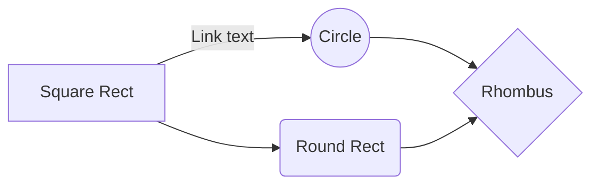

## Add Graphs to MDX

### Mermaid Library
To generate graphs in MDX files, we need to use the [mermaid](https://mermaidjs.github.io/) library.
We forked the [gatsby-remark-graph](https://github.com/konsumer/gatsby-remark-graph) plugin and modified it to work with MDX files.
You can see the contents of the modified plugin in **/plugins/remarks/gatsby-remark-mdx-mermaid/**

This current file (src/pages/getting-started/add-graphs-to-mdx.mdx) is an example of how to implement graphs in MDX.

### Example code
**Markdown**
````

````

**HTML Output**

