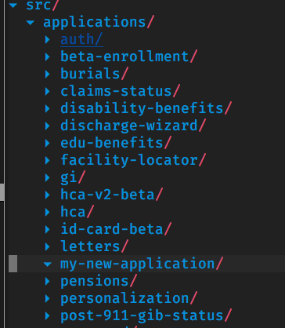

# Creating a new application

Note: Check out the [Adding a new feature](/getting-started/common-tasks/new-feature) doc to make sure you're trying to add the right type of feature to VA.gov.

## Yeoman generator

The easiest way to create a new application is with the Yeoman application generator. You can use the [walkthrough](/platform/tools/generator) to create your own regular or form application. The manual set up process is below, which you can read through to get a better understanding of the different pieces that are needed.

## Manual set up

Here are the steps for manually setting up a new application. We're going to walk through setting up an application called "my new application."

1. Create a new folder for your application in `src/applications/`. In our case, we're using `my-new-application`:



2. Add a manifest.json file in the new folder. This file contains important information about your application:

```js
{
  // Name of your application, not Veteran facing
  "appName": "My new application",
  // The Webpack entry point to the bundle for your application
  "entryFile": "./my-new-application-entry.jsx",
  // The Webpack bundle name for your app. Must be unique.
  "entryName": "my-new-application",
  // The root url where your application lives
  // This one is only used by webpack-dev-server for local development
  "rootUrl": "/my-new-application",
}
```

3. Add an entry to `src/applications/registry.json`. This file contains information that the content build needs to create the landing page for your application:

```js
{
  // Name of your application, not Veteran facing
  "appName": "My new application",
  // The Webpack bundle name for your app. Must be unique.
  "entryName": "my-new-application",
  // The root url where your application lives
  "rootUrl": "/my-new-application",
  // Properties specific to rendering your application's HTML landing page
  "template": {
    // Document title
    "title": "My new application",
    // Standard Metalsmith Liquid template for React applications
    "layout": "page-react.html",
    // <meta name="description">
    "description": "A new application!",
    // <meta name="keywords">
    "keywords": "not required, but good practice for public apps",
    // A feature toggle, indicating that this application is excluded from production builds
    "vagovprod" false
  }
}
```
   

4. Create the file you referenced in the `entryFile` property above:

```jsx
import 'platform/polyfills';
import './sass/my-new-application.scss';

import startApp from 'platform/startup';

import routes from './routes';
import reducer from './reducers';
import manifest from './manifest';

startApp({
  url: manifest.rootUrl,
  reducer,
  routes,
  entryName: manifest.entryName,
});
```

This file uses our `startApp` helper to create a React/Redux app that has client-side routes handled with `react-router`. You can leave out the routes or reducer if you don't need Redux or `react-router`. There's also a reference to a Sass file, which will set up the styles for your application.

5. Create Sass file (`src/applications/my-new-application/sass/my-new-application.sass`):

```scss
@import "~@department-of-veterans-affairs/formation/sass/shared-variables";

// Your custom sass
```

6. Create reducer (`src/applications/my-new-application/reducers/index.js`):

```js

const initialState = {
  // whatever initial state you have
};

function myNewApplication(state = initialState, action) {
  switch (action.type) {
    case SOME_ACTION:
      return state;
    default:
      return state;
  }
}

export default {
  myNewApplication
};
```

This is a normal Redux reducer, and can be broken up into different state slices as needed. The only thing to note is that it needs to return an object, not a function. This object will get merged with other state data and then turned into a function using Redux's `combineReducers` function.

7. Create routes file (`src/applications/my-new-application/routes.jsx`):

```jsx
import React from 'react';
import { Route, IndexRedirect } from 'react-router';

import MyPage from './containers/MyPage.jsx';
import MyNewApplicationApp from './containers/MyNewApplicationApp.jsx';

const routes = (
  <Route path="/" component={MyNewApplicationApp}>
    <Route component={MyPage} path="my-page"></Route>
    <IndexRedirect to="my-page" />
  </Route>
);

export default routes;
```

You can add new pages and whatever routed components you need in this file.

And that's it! If you fill out the routes.jsx file with pages that exist, you should be able to start up VA.gov and see it working locally.

## Going to production

The above steps will only enable your application in our staging and dev environments. In order to enable it in production, you'll have to remove the feature toggle added into your application's entry in the `registry.json`.

```js
{
  "appName": "My new application",
  "entryName": "my-new-application",
  "rootUrl": "/my-new-application",
  "template": {
    "title": "My new application",
    "layout": "page-react.html",
    "description": "A new application!",
    "keywords": "not required, but good practice for public apps",

    // ALLOW THIS TO SHIP TO PRODUCTION BY SETTING THIS TO TRUE
    "vagovprod" false
  }
}
```
