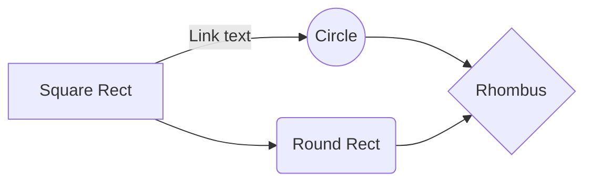

## Create a Gatsby Remark plugin
Gatsby uses a plugin called [gatsby-transformer-remark](https://www.gatsbyjs.org/packages/gatsby-transformer-remark/)
to convert markdown to html. Our MDX plugin [gatsby-mdx](https://www.gatsbyjs.org/packages/gatsby-mdx/) uses this plugin
to convert markdown to html. We needed to create a way to add graphs to our MDX files so we tried to implement another plugin that adds the [mermaid](https://mermaidjs.github.io/) feature to markdown. The problem was that it had conflicts with MDX files. This article will detail how we added our own plugin locally to the `gatsby-transformer-remark` plugin to solve this issue.

### What are we doing
We needed a way to generate graphs using markdown like the code below. Normally this is done using the mermaid library. That is what we are going to use, but we need it to work with MDX files. Below is an example of what we are trying to do.

**Markdown**
````

````

**HTML Output**


Remark uses a plugin system that enables you to do some customization when the markdown gets converted into html through Remark. That is what we are going to use to convert our markdown into a graph.

- First we need to create a plugin that we can add to the `gatsby-transformer-remark` plugin.

  Below is the code we are using to generate the html to convert our code into graphs. When adding this to the plugin, this code will run during the transformation phase. In this code we are taking the `mardownAST` and finding mermaid specific code on the page. Then we change the code to html.

  ```javascript
  // plugins/remark/gatsby-remark-mdx-mermaid/index.js

  const visit = require('unist-util-visit');

  module.exports = ({ markdownAST }, { language = 'mermaid', theme = 'default' } = {}) => {
    visit(markdownAST, 'code', node => {
      let lang = (node.lang || '').toLowerCase()
      if (lang === language) {
        node.type = 'html'
        node.value = '<div class="mermaid">{' + '`'+ node.value + '`'+ '}</div>'
      }
    })
  }
  ```

  This markdown code:

  ````
  ```mermaid
  graph LR
      A[Square Rect] -- Link text --> B((Circle))
      A --> C(Round Rect)
      B --> D{Rhombus}
      C --> D
  ```
  ````

  Will generate:

  ```
  <div class="mermaid">
  `
  graph LR
      A[Square Rect] -- Link text --> B((Circle))
      A --> C(Round Rect)
      B --> D{Rhombus}
      C --> D
  `
  </div>
  ```

  Notice the back ticks inside the innerText. This was done because of MDX. MDX was interpreting the `{}` as JSX templating which causes an error. So we need to wrap the code in back ticks to make it work with MDX files.

- Add it to our MDX remarks plugin.

  In our `gatsby-config.js` file we need to add our plugin to the `gatsby-mdx plugin`. Because this is a Remark plugin we need to add it to `gatsbyRemarkPlugins`. This is where you can add `gatsby-transformer-remark` specific plugins.

  ```javascript
  // gatsby-configs.js

  {
    resolve: `gatsby-mdx`,
    options: {
      extensions: ['.mdx'],
      mediaTypes: ['text/x-markdown'],
      defaultLayouts: {
        default: require.resolve("./src/layouts/layout.js"),
      },
      gatsbyRemarkPlugins: [
        {
          resolve: path.resolve(__dirname, './plugins/remark/gatsby-remark-mdx-mermaid'),
          options: {
            language: 'mermaid',
            theme: 'default'
          }
        }
      ],
    }
  }
  ```
- Add the mermaid library so it can convert our code into SVG graphs

  Because mermaid is a client side library we need to include it when the build is rendered on the client-side.
  To do this we add some code to our Layout Component that will inject the script in the **componentDidMount** lifecycle hook.

  ```javascript
  class Layout extends React.Component {
    componentDidMount() {
      window.mermaid_config = { theme: 'default', startOnLoad: true }
      const s = document.createElement('script');
      s.setAttribute('src', 'https://unpkg.com/mermaid@7.1.0/dist/mermaid.min.js');
      document.head.appendChild(s);

      if (window.mermaid) {
        window.mermaid.init(undefined, document.getElementsByClassName('mermaid'));
      }
    }
    .....
  }
  ```

- Once all this all setup we are good to go.
