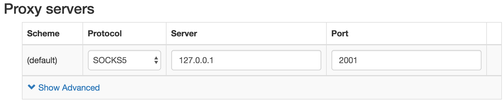
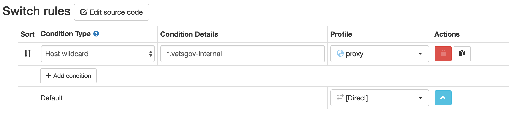
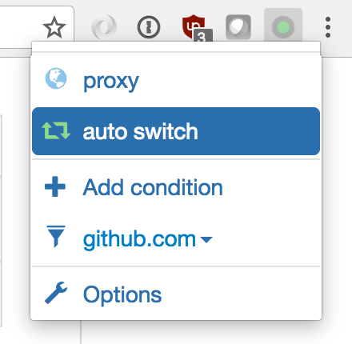
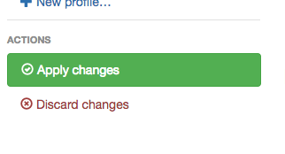

# Internal Tools

These instructions cover the configuration of a SOCKS proxy necessary for access to:

* Static `vets-website` content
* Remote build logs for pull requests and deployments (Jenkins)
* System metrics for diagnostic/troubleshooting purposes
* Exception reports and tracebacks

## Prerequisites and assumptions

- These steps assume you're running on Linux or OSX.
- That you have a Github account that's [configured](https://help.github.com/en/articles/adding-a-new-ssh-key-to-your-github-account) to use `.ssh` authentication with one of your computer's public keys.

## Create an SSH public key

*You can skip these steps if you have a public ssh key you want to use. These instructions refer to the public key as `id_rsa_vagov.pub`*

1. Open a terminal and create an `~/.ssh` directory
```bash
mkdir ~/.ssh
```
*It's safe to ignore the error if this directory already exists*

2. Set the `~/.ssh` directory to read only.
```bash
chmod 700 ~/.ssh
```

3. Change to the `~/.ssh` directory

```bash
cd ~/.ssh
```

4. Generate the ssh keys. You will be prompted to enter a secure passphrase to protect your private key.

```bash
ssh-keygen -f id_rsa_vagov
```
5. Confirm that the keys were generated.

```bash
ls ~/.ssh
```
*The list of files should include `id_rsa_vagov` and `id_rsa_vagov.pub`. Only share keys with `.pub` (public) extension; Private keys should never leave your computer.*

## Configure the SOCKS proxy
Below are configuration instructions for internal or external developers.

### For internal developers

6. Change to your working directory, clone and change to the devops repository
```bash
cd ~/YOUR-WORKING-DIRECTORY
git clone git@github.com:department-of-veterans-affairs/devops.git
cd devops
```

7. Checkout a branch using your lowercase first and last name
```bash
git checkout -b add-key-first-last
```
8. Copy your public key into the `authorized_keys` folder renaming the file with your email address
```bash
cp ~/.ssh/id_rsa_vagov.pub ./ansible/roles/dsva-config/files/authorized_keys/YOUR@EMAIL.COM
```
9. Edit the `./ansible/global/config.yml` in the `devops` repo by adding your email address to the list of emails under the appropriate group (`developers:`, `devops:`, etc.)

*Please try to keep this list alphebetized.*

10. Commit and push your changes to the `devops` repo
```bash
git add .
git commit -m 'add ssh keys for first-name last-name'
git push origin add-key-first-last
```

11. Create a PR for this branch on Github. In the #vetsgov-devops channel on the DSVA Slack, share a link to the PR and indicate that you need your ssh keys added to the `devops` repo.

12. Copy the SSH config from the `devops` repo to `~/.ssh`
```bash
cp ./ssh/config ~/.ssh/config
```

13. Add your SSH key to your local agent
```bash
ssh-add -K ~/.ssh/id_rsa_vagov
```
*If you're on OSX you can configure the ssh client to automatically add your keys with the by adding the following to the top of `~/.ssh/config`*
```
  Host *
    AddKeysToAgent yes
    UseKeychain yes
    IdentityFile ~/.ssh/id_rsa
    IdentityFile ~/.ssh/id_rsa_vagov
```

14. Wait for `devops` team to review, approve, and merge your pull request

*Once your pull request is merged, an update job should automatically run to update the jumpboxes and SOCKS proxy endpoints. This job takes about 5 minutes to run. Wait five minutes, then continue with* **Starting the SOCKS proxy**.

### For external developers

6. As part of onboarding, you should have provided your **public SSH key** to DSVA. If you haven't, do that now.
7. DSVA will add your public SSH key to the list of authorized keys.
8. When that process is completed (24 hours), you will receive a Github notification that your key has been added.

*Once you receive the notification, continue with* **Starting the SOCKS proxy**.

## Starting the SOCKS proxy
There are slightly different commands to connect to the proxy depending on whether you are connected to the VA network or not. The `~/.ssh/config` file on your local system contains configuration to access the SOCKS proxy both from the VA network and the internet.

- If you're on the VA network, run:

```bash
ssh socks-va -D 2001 -N &
```

 - If you're on the internet (outside the VA network), run:

```bash
ssh socks -D 2001 -N &
```

_The first time you connect to the jumpbox, ssh will prompt to ask if you are sure you want to connect to a new host. You will be unable to respond "yes" if ssh is in the background, so either bring it to the foreground with `fg` or omit the `&` character from the above command._

_After running the command below, continue to_ **Testing and Using thje SOCKS proxy**

## Testing and Using the SOCKS proxy
Use the following steps to verify that the proxy connection is working, and to configure your
browser to use the proxy connection. Note that the proxy only allows access to our internal
tools, not to the internet at large. So you need to configure your browser to either use the proxy
only for the `vetsgov-internal` domain (as described below for Chrome); enable/disable the proxy
connection as needed; or use a separate browser for accessing the internal tools vs. for general
use.

### Curl

To test your proxy connectivity, the best option is to run the following command:

`$ curl -v --proxy socks5h://127.0.0.1:2001 sentry.vetsgov-internal`

You should get output that includes `HTTP/1.1 302 FOUND`. If not, check that the
SOCKS proxy server is running. You can `$ nc -z 127.0.0.1 2001` as a first step.

### Chrome

1. Install Proxy SwitchyOmega

   https://chrome.google.com/webstore/detail/proxy-switchyomega/padekgcemlokbadohgkifijomclgjgif

1. Configure the `proxy` profile like this:

   

1. Configure the `auto switch` profile like this:

   

1. In Chrome's menu bar, click on the proxy app and change the setting to 'auto switch':

   

1. Be sure to hit the Apply Changes button to save your changes!

   

1. NOTE: You may have to uncheck a settings flag in Chrome, see

   https://github.com/FelisCatus/SwitchyOmega/wiki/DNS-and-SOCKS-proxy

1. Check your connection by navigating to Sentry at
   http://sentry.vetsgov-internal.

### Firefox

1. Install Proxy Switcher
   https://addons.mozilla.org/en-US/firefox/addon/proxy-switcher/
1. create a file on your system with the following contents
    ```
    function FindProxyForURL(url, host) {
		     if( /.*\.vetsgov-internal$/.test(host) ) {
    		 	 return 'SOCKS5 localhost:2001';
		     }
    		 return 'DIRECT';
    }
    ```
1. Configure the `automatic` tab by setting the path to be the file created above
1. Press the reload button in the proxy switcher configuration dialog
1. Check your connection by navigating to Sentry at
   http://sentry.vetsgov-internal.

## Issues
If your key doesn't seem to be working, contact the Platform team in the *#vetsgov-devops* Slack channel.

## Tools

### Jenkins
With the Socks proxy set up and running, go to http://jenkins.vetsgov-internal. You can see the builds without logging in, but will need to authenticate (with GitHub) to re-run failed builds.

### Sentry

With the Socks proxy set up and running, go to http://sentry.vetsgov-internal. You will need to register for Sentry, but after creating any username/password, you will have access. We do not really use Sentry teams except to separate production, staging, and dev errors. To view the most recent production errors, which is the most common thing to do while on call, go to http://sentry.vetsgov-internal/vets-gov/platform-api-production/

### Grafana
With the Socks proxy set up and running, go to http://grafana.vetsgov-internal. You will need to register for Grafana, but after creating any username/password, you will have access.

There are many dashboards and you should click around to get familiar with the variety of metrics being collected and visualized (make sure Data Source is set to Production). A few highlights are:

- [Site](http://grafana.vetsgov-internal/dashboard/db/site) to see overall metrics about the health of the site
- [External Service Status](http://grafana.vetsgov-internal/dashboard/db/external-service-status) to see the availability of the services vets.gov depends on.
- [RDS](http://grafana.vetsgov-internal/dashboard/db/rds) to see the database statistics.
- [Rev Proxy](http://grafana.vetsgov-internal/dashboard/db/revproxy) to see metrics on the reverse proxies.
