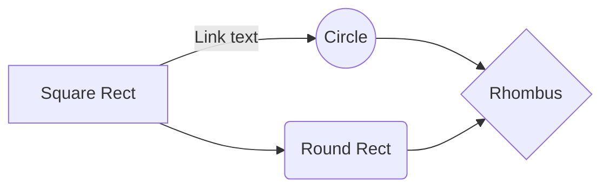

### Mermaid Library
To use the graph generator for markdown we need to use the mermaid library. We are using [gatsby-remark-graph](https://github.com/konsumer/gatsby-remark-graph) to do this. We are limited to only using this with .md files and it will not work .mdx files. It might be possible to make this work with .mdx files in the future but it might take some time to implement.

[https://mermaidjs.github.io/](https://mermaidjs.github.io/)

This current file (src/pages/getting-started/markdown-mermaid-graph) is an example of how to implement it.

### Example code
**Markdown**
````

````

**HTML Output**

