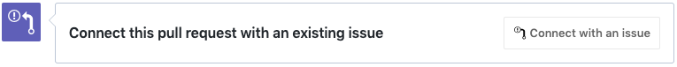
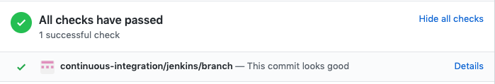
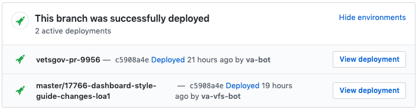

# Review

<div class="deprecation-message">
  <h2>We're moving our docs!</h2>

  <h3>
    Find 
    <a href="https://depo-platform-documentation.scrollhelp.site/developer-docs/Frontend-workflow:-Review.1845919891.html">
      the latest version of this page
    </a>
    on the Platform website.
  </h3>

  <h3>
    Still can't find what you're looking for? Reach out to 
    <a href="https://dsva.slack.com/archives/CBU0KDSB1">
      #vfs-platform-support
    </a>
    on Slack.
  </h3>
</div>

## Submit pull request

- **Pull main** and **push feature branch** to `vets-website` and/or `content-build` repositories

```bash
git pull origin main
git push origin feature/12345-issue-title
```

**Note:** If you are making changes in both repositories that are dependent on each other, you should give both branches in each repository the same name.

*Always **pull main** into your feature branch before creating a pull request.*

- **Create a pull request** indicating that your code is ready for review.
- **Request peer review** on Github by tagging a fellow team member who you feel is qualified to review the code (this prevents the pull request from just sitting). You may also want to tag developers on other teams if the changes cover more than one application.

*Depending on the type of work done, you may need a product person to review and / or a developer to review. See [Code Review Norms](https://github.com/department-of-veterans-affairs/vets.gov-team/blob/master/Work%20Practices/Engineering/Code%20Review%20Norms.md) for more information on how we do code reviews.*

- Use Zenhub to **connect** pull request with a **linked issue**

*If you use the Zenhub Chrome [extension](https://chrome.google.com/webstore/detail/zenhub-for-github/ogcgkffhplmphkaahpmffcafajaocjbd), there will be a "Connect this pull request with an existing issue" section at the bottom of Github's create pull request UI. You can click the "Connect with an issue" button to link the PR to the original issue in Zenhub.*



- **Change status** of the **linked issue** to **validate**

## Run tests and compliance scans

- **Jenkins** automatically **builds** and **runs all tests** your feature branch:
  - when the pull request is created
  - after a pull request is created when the feature branch is updated
- Test results are displayed on the pull request page



*See [Run Tests](/getting-started/common-tasks/test) to run these tests locally*

## Manually test change

Manual testing can involve some separate things:

- Making sure the functionality works in the web browsers users are most likely to use
- Run the code on production-like environment. This could be done by spinning up a cloud instance that resembles production, or launching a container that is production like (such as a Docker image, etc.)
- See if there are there any bugs or unexpected nuisances that users might encounter
- Does it meet the requirements?

***The person making the change is responsible** for ensuring the change is adequately tested. Testing can include automated tests or manual testing by stakeholders on the review instance or staging build.*

### Review instance automatic creation

**Jenkins** automatically **deploys** two remote **review instances** of a **feature branch** when a pull request is created:

- an instance that just includes static pages content deployed by **va-bot**
- an instance that includes static pages and the VA.gov client application deployed by **va-vfs-bot**

*Example of deployment links:*



After a pull request is created, **Jenkins** will automatically **rebuild** these instances when feature branch **changes are pushed**

To review dependent changes made in `vets-website` and `content-build` pull requests in the same review instance, verify both branches in each repository have the same name. The review instance deployment in both pull requests will share the same link. Changes made in either pull request will be deployed to that review instance.

*You will need your browser configured to access the vetsgov-internal domain via the SOCKS proxy. Please see the [2. Access internal tools](/getting-started/internal-tools) for detailed instructions.*

### Review instance manual creation

**Jenkins** can be **manually triggered** to build a **review instance**.

1. Visit the [Jenkins Review Application Deploy job UI](http://jenkins.vfs.va.gov/job/deploys/job/vets-review-instance-deploy/) and log in.
2. Select **Build with Parameters**
3. Specify the branch names for `api_branch`, `web_branch`, and `content_branch`. These branches will be deployed together with the review instance.
4. When the process is completed, the URL for the review instance will be provided at the end of the output logs.

*A Jenkins job will run periodically and remove review instances for which the source branches no longer exist. To ensure that your instance is cleaned up appropriately, just delete the branch from the origin repository.*

## Peer review and merge

- Get at least one **pull request approval** from a peer
- It is recommended not to merge at the end of the day or right before the weekend unless necessary.
- [Squash your commits](https://github.blog/2016-04-01-squash-your-commits/) and **merge** into **master**
- **Delete** pull request branch

*See our team's [code review norms](https://github.com/department-of-veterans-affairs/va.gov-team/blob/master/platform/engineering/code_review_guidelines.md) for details on how code review work and what needs to be checked.*
