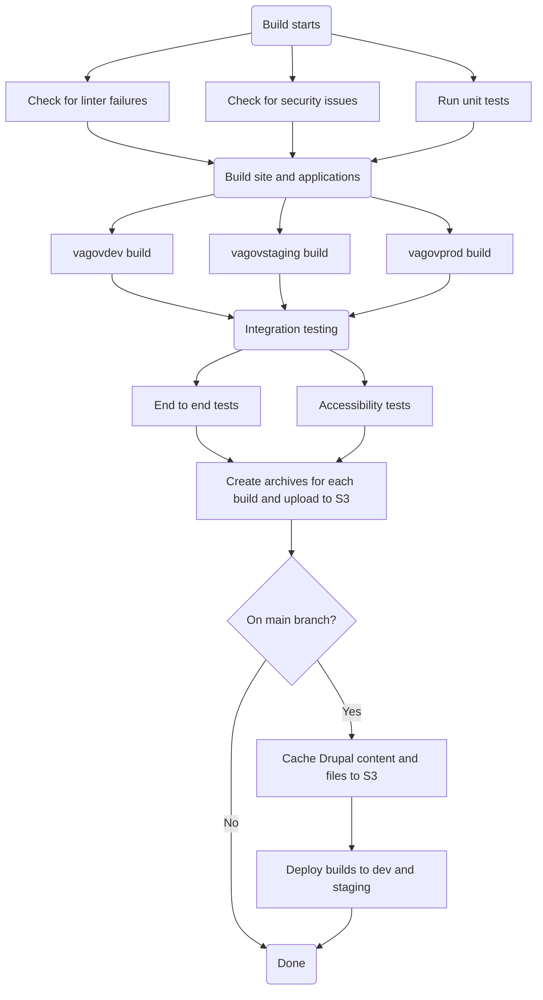
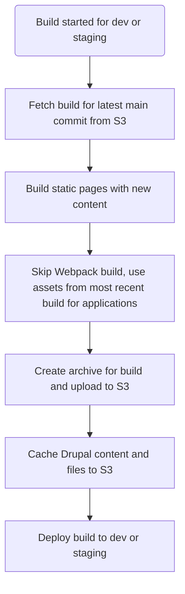
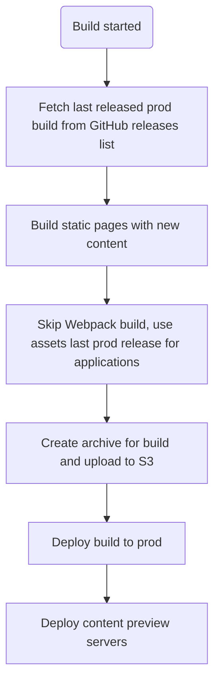
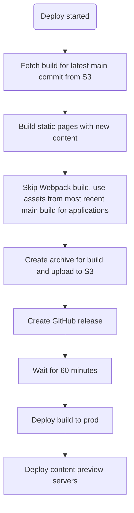

# Build and deploy process flows

  <h2>We're moving our docs!</h2>
  <h3>
    Find{' '}
    <a href="https://depo-platform-documentation.scrollhelp.site/developer-docs/Build-and-deploy-process-flows.1844346924.html">
      the latest version of this page
    </a>{' '}
    on the Platform website.
  </h3>
  <h3>
    Still can't find what you're looking for? Reach out to{' '}
    <a href="https://dsva.slack.com/archives/CBU0KDSB1">
      #vfs-platform-support
    </a>{' '}
    on Slack.
  </h3>

Here you'll find flow diagrames for the different types of build and deploy flows we have for VA.gov. Those different flows are:

- [Standard main/PR build](#standard-masterpr-build)
- [Content only build and deploy](#content-only-build-and-deploy)
- [Daily deploy](#daily-deploy)

## Standard main/PR build

This is the typical Jenkins build for any vets-website branch. There is some logic that is different between main and other branches:

## Content only deploy

When content is changed in Drupal, sometimes we need to publish it immediately on a va.gov site. There are two separate processes for this, one for staging/dev and another for production.

### Staging/dev content deploy

### Production content deploy

## Daily deploy

