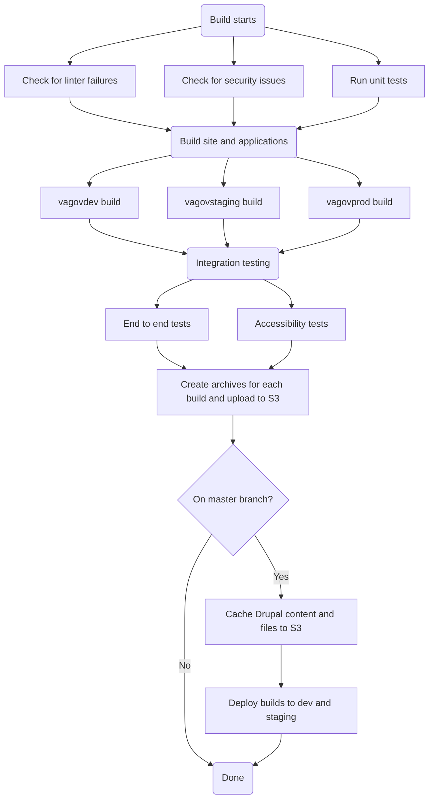
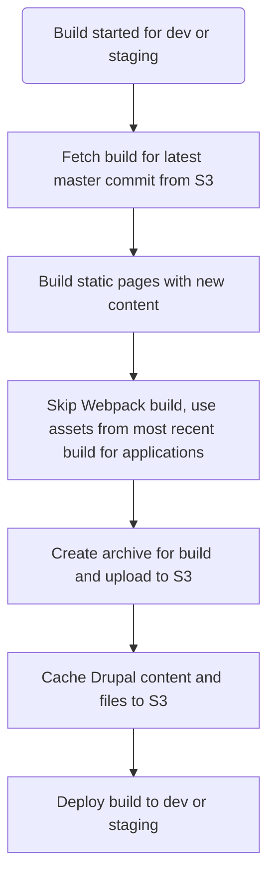
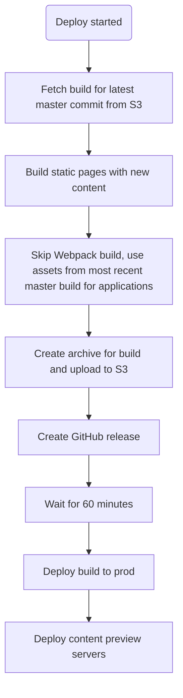

# Build and deploy process flows

Here you'll find flow diagrames for the different types of build and deploy flows we have for VA.gov. Those different flows are:

- [Standard master/PR build](#standard-masterpr-build)
- [Content only build and deploy](#content-only-build-and-deploy)
- [Daily deploy](#daily-deploy)

## Standard master/PR build

This is the typical Jenkins build for any vets-website branch. There is some logic that is different between master and other branches:

## Content only deploy

When content is changed in Drupal, sometimes we need to publish it immediately on a va.gov site. There are two separate processes for this, one for staging/dev and another for production.

### Staging/dev content deploy

### Production content deploy

## Daily deploy

