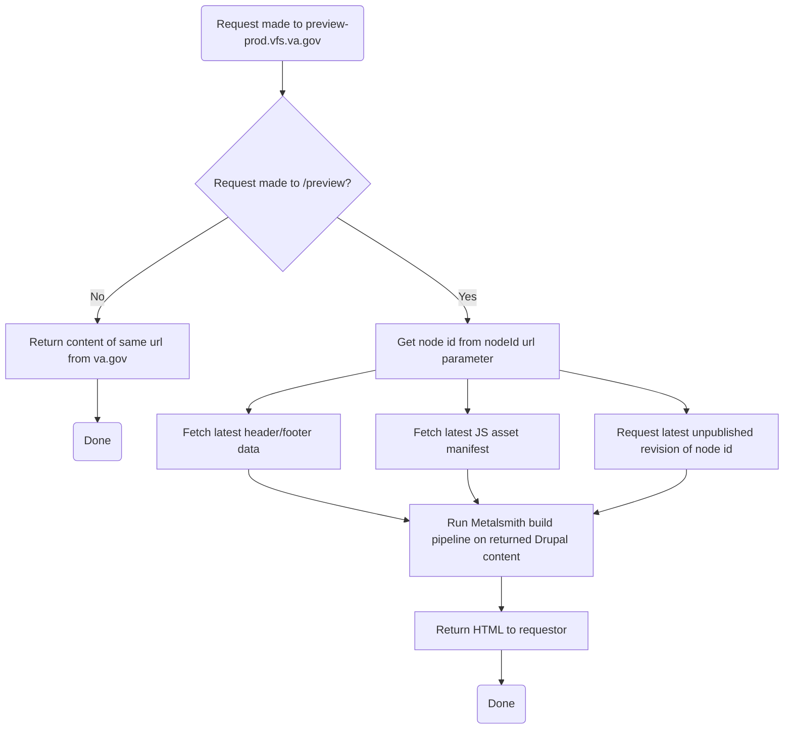

# VA.gov content management system overview

The VA is currently in the process of moving content from several other systems into one primary content management system, powered by Drupal. VA.gov takes a decoupled approach, where content editors make change in a Drupal environment, then VA.gov build process queries that Drupal instance and transforms the resulting content into static html that is deployed on the site. Drupal does not control any Veteran-facing page rendering.

In addition, there is a system that can be used to view content changes on demand, outside of the typical build process, so that content editors can preview their changes before they go live.

## Existing content sources

Content displayed on VA.gov exists in four primary locations:

- The [vagov-content repo](https://github.com/department-of-veterans-affairs/vagov-content), in Markdown and YAML
- The [vets-website repo](https://github.com/department-of-veterans-affairs/vets-website) (footer link data in JSON, plus templating)
- Teamsite, the VA's legacy content management system
- Drupal, the VA's current content management system

Eventually, all this content will be consolidated and moved into Drupal.

## Drupal environments

All Drupal environments require you to either be on the VA network or the SOCKS proxy.

| Environment | Site url                  | VA.gov environment     |
| ----------- | ------------------------- | ---------------------- |
| development | http://dev.cms.va.gov     | https://dev.va.gov     |
| staging     | http://staging.cms.va.gov | https://staging.va.gov |
| production  | http://prod.cms.va.gov    | https://www.va.gov     |

## How content is transformed into pages

VA.gov is a static html/js/css site, built with a static site generator tool called Metalsmith. During the Metalsmith build process we query the appropriate Drupal environment with a GraphQL query. The results of that query are transformed into pages through the Metalsmith build pipeline. There are [liquid](https://shopify.github.io/liquid/) templates specific to page content that came from Drupal, generally denoted with a `.drupal.liquid` suffix. Each `entity` from Drupal has a corresponding `entityType`, which is used to choose the entry template for each `entity` (i.e. page) from Drupal.

- [Metalsmith build process diagram](/platform/architecture/static-site)
- [Primary GraphQL query](https://github.com/department-of-veterans-affairs/vets-website/blob/master/src/site/stages/build/drupal/graphql/GetAllPages.graphql.js)
- [Entry templates](https://github.com/department-of-veterans-affairs/vets-website/tree/master/src/site/layouts)

## Jenkins build process integration

Drupal is queried in the Jenkins build process for any vets-website branch. On Jenkins, however, there is a caching mechanism to help deal with downtime and other failures in the live Drupal environments. After any successful master build, the results of the GraphQL query and any files downloaded from Drupal during the build process are put into a tarball and uploaded to S3. For builds on any branch, if the site build (the `npm run build` command) fails, Jenkins will download the appropriate cache and retry the build.

- [Jenkins build process flow](/platform/architecture/build-deploy-flows#standard-masterpr-build)
- [Drupal/AWS cache script](https://github.com/department-of-veterans-affairs/vets-website/tree/master/script/drupal-aws-cache.js)

### Automated accessibility checking

All pages created and managed with the content management system are required to pass accessiblity scans for [WCAG2 Level A and AA](https://www.w3.org/TR/WCAG20/) compliance. To help prevent a broad class of errors, we have [created an accessibility checker](https://github.com/department-of-veterans-affairs/vets-website/pull/10836) that can be used on localhost and the [CMS preview servers](#preview-server) listed below.

#### Reviewing issues on localhost

- Start your SOCKS proxy
- Open a terminal window
- Build Va.gov locally (run this command in the terminal):
  ```
  $ npm run build -- --pull-drupal --entry=static-pages --accessibility
  ```
- When Step 3 is complete, type the following command in the terminal:
  ```
  $ npm run preview
  ```
- Open a browser window and copy this URL: **http://localhost:3001/preview?nodeId=67**
- Click on the light blue banner at the top of the screen to learn more about any accessibility issues

#### Reviewing issues on a preview server

- Start your SOCKS proxy
- Open a browser window and copy this URL: **http://preview-dev.vfs.va.gov/preview?nodeId=67**
- Click on the light blue banner at the top of the screen to learn more about any accessibility issues

#### Interpreting accessibility violations and warnings

The accessibility preview shows Section 508 and WCAG violations, as well as best practice warnings. The Jenkins build process will break on accessibility violations, but not best practice warnings.

Click the text **There are N accessibility issues on this page** inside the light blue banner. The text will expand to show a list of accessibility issues. Click an individual issue to get more detailed information.

Each issue contains five elements:

- **Description:** a brief explanation of the issue
- **Impact:** the amount of trouble this issue could cause for users
- **Tags:** the type of issue. Any tags that include [WCAG violations](https://www.w3.org/TR/WCAG20/) and **must** be fixed.<br/>_This is the most important item to focus on._
- **Help:** a link to the Deque University help page for this issue
- **HTML:** a text rendering of the HTML fragment that is causing or contains the issue

If you are having trouble determining why an accessibility issue is being shown, or would like guidance on best practices, reach out to the VSP product support team on Slack.

## Deployment

A typical cms deploys content changes to users immediately, because the content is stored in the same system that renders the pages that contain that content. In our decoupled approach, however, content needs to be run through the VA.gov build process before it can go live. There are two ways of getting content onto VA.gov:

- [Scheduled daily deploy](/platform/architecture/build-deploy-flows#daily-deploy)
- [Off schedule content only deploy](/platform/architecture/build-deploy-flows#content-only-deploy)

The scheduled deploy begins at 2pm ET, and fetches new content from Drupal before deploying. The off schedule deploy is a Jenkins job that can be triggered from a button in the production Drupal environment which will get the currently released code and update it with the latest content from Drupal.

Off schedule deploys can be done for all environments, however there are separate Jenkins jobs for production vs staging/dev.The main difference is that dev/staging deploys update the latest builds from vets-website master with new content and the production deploy updates the latest released code on VA.gov with new content.

## Preview server

A typical cms also provides an easy way to preview changes before making them live, because it can render unpublished content with the templates and rendering logic in the same cms. A decoupled approach can't do this by default, so we created a preview server to emulate it. The preview servers query Drupal for the latest unpublished revision of a specified page, then run an abbreviated verion of the Metalsmith build process for that single page and return the resulting html. This is done per request and the results are not written to the server.

| Environment | Site url                          | VA.gov environment     |
| ----------- | --------------------------------- | ---------------------- |
| development | http://preview-dev.vfs.va.gov     | https://dev.va.gov     |
| staging     | http://preview-staging.vfs.va.gov | https://staging.va.gov |
| production  | http://preview-prod.vfs.va.gov    | https://va.gov         |

The preview server is written in Node and Express, [located in vets-website](https://github.com/department-of-veterans-affairs/vets-website/blob/master/script/preview.js).

Requests that are made to the preview server that are not to the special `/preview` route are proxied to the associated live site. So, for example, a request for `/health-care` on the staging preview server will request the `/health-care` page from staging.va.gov. If you were trying to preview an unpublished version of the `/health-care` page you would go to `/preview?nodeId=<id of health care entity>`.

### Preview server request flow


