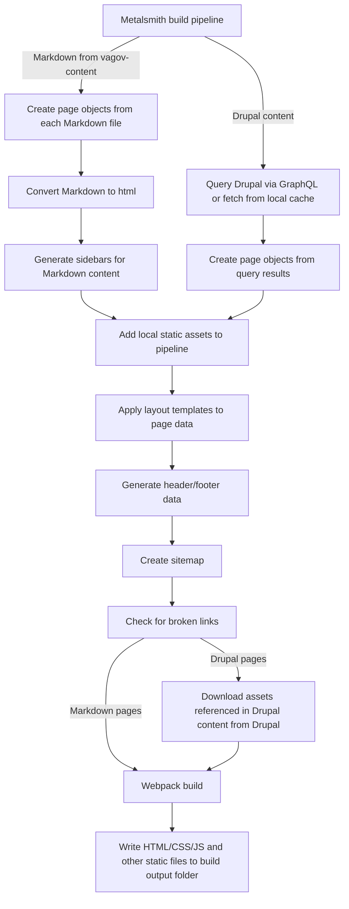

# Site build process

The main build process for VA.gov is controlled with Metalsmith, which is a simple, plugin-based static site generator. We take content from two sources, the vagov-content repo and the VA's Drupal CMS, create pages based on that data plus templates, run a series of other plugins, and then output the resulting html pages.

## Metalsmith build flow

There are other plugins than the ones listed in this diagram, but these are the most important ones. The process is very similar for Markdown and Drupal content, mostly differing in how the content is initially converted into page objects for Metalsmith to process.

## Metalsmith code organization

Metalsmith related code is located in `src/site`. Most of the code in that folder are temlates for Drupal content. The build process code is located in `src/site/stages` which contains Metalsmith plugins and GraphQL queries. 

## Drupal templates vs Markdown templates

Due to the differences in the shape of data in vagov-content vs Drupal, we have two different sets of templates, one for each source. There are some shared templates, but these are largely restricted to the header and footer templates. Drupal related templates end with `.drupal.liquid` and Markdown templates typically end with `.html` or `.liquid`.
