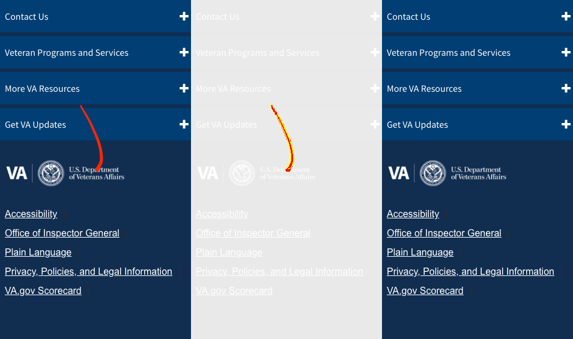
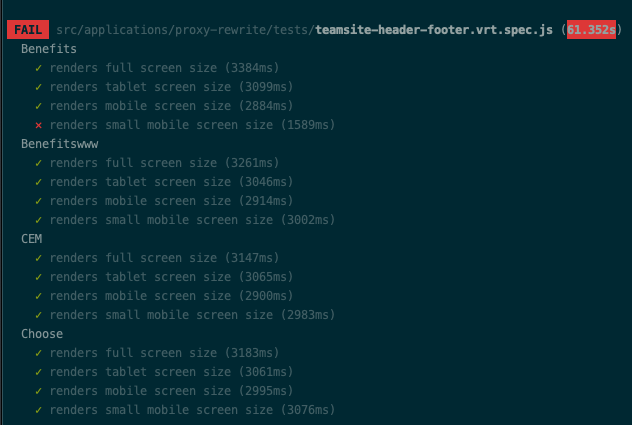
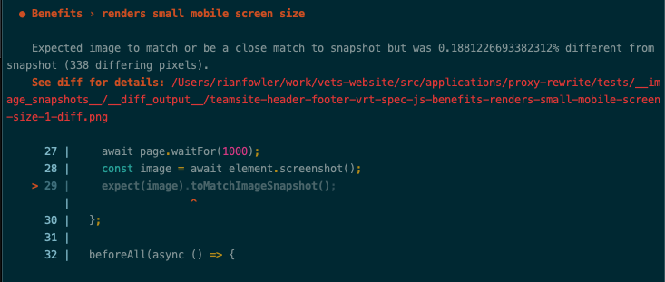

# Teamsite Overview

Updated from [TeamSite Technical Solution and Implementation](https://github.com/department-of-veterans-affairs/vets.gov-team/issues/12779#issue-356005850)

EWIS serves much of the existing content on www.va.gov (e.g. www.va.gov/health) and to accomodate this our systems serve that request from our version of the site on sites that exist on the same domain.


Requests to subdomain hosts such as www.benefits.va.gov are not proxied through our systems and are not under our control. Content for these sites exists on TeamSite: a content management system utilized by the VA to manage content across several properties at the VA. Each property in TeamSite consists of perl-based template files, which on publish rendered content to a file store. The rendered content contains server side includes, which reference content from a directory called `va_files`, which has shared header and footer functionality.

There are no consistent staging/production environments for TeamSite properties, and there are multiple variants of header and footer functionality in `va_files` (attached to this issue). For properties that do have staging and production variants, they reference the same version of header and footer content. A change to the header or footer will affect both the staging and production versions of a property.


## Scripts and Teamsite Administration

The header injection markup is added to Teamsite templates by their administrator. Current point of contact for this is:

- Josh Tuscher <Joshua.Tuscher@va.gov>

Current markup added to Teamsite templates:

```html
<style type="text/css">.brand-consolidation-deprecated { display: none !important; } </style>
<link rel="stylesheet" href="https://prod-va-gov-assets.s3-us-gov-west-1.amazonaws.com/generated/styleConsolidated.css" />
<script type="text/javascript" src="https://prod-va-gov-assets.s3-us-gov-west-1.amazonaws.com/js/settings.js"></script>
<script type="text/javascript" src="https://prod-va-gov-assets.s3-us-gov-west-1.amazonaws.com/generated/polyfills.entry.js"></script>
<script type="text/javascript" src="https://prod-va-gov-assets.s3-us-gov-west-1.amazonaws.com/generated/vendor.entry.js"></script>
<script type="text/javascript" src="https://prod-va-gov-assets.s3-us-gov-west-1.amazonaws.com/generated/proxy-rewrite.entry.js"></script>
<script type="text/javascript" src="https://prod-va-gov-assets.s3-us-gov-west-1.amazonaws.com/js/vendor/uswds.min.js"></script>
```

## Teamsite Behavior and Whitelisting Pages

There are an unknown number of Teamsite templates that drive the `<head>` content on Teamsite pages and there are several pages that receive the above markup that **should not** show the va.gov header. The proxy rewrite application uses a [whitelist](https://github.com/department-of-veterans-affairs/vets-website/blob/b770f380270722228563e56629af440c64342157/src/applications/proxy-rewrite/proxy-rewrite-whitelist.json) to drive the activation of the header content. Example whitelist entry:
```
{
  "hostname": "www.benefits.va.gov",
  "pathnameBeginning": "/",
  "cookieOnly": false
},
```
Pages can be whitelisted in two ways:
- `cookieOnly: false` - the header will always activate
- `cookieOnly: true` - the header will activate when `proxyRewrite` cookie is set to true.

This cookie can be set in the console by running `document.cookie = "proxyRewrite=true;"`

### Considerations when editing and testing the whitelist

- Some Teamsites redirect to both `subdomain.va.gov` and `www.subdomain.va.gov` (sometimes alternating between the two). Always test the redirect behavior of the first level of links on the page and ensure that both hosts are whitelisted if necessary.
- New hostnames need to be added to our `allowed_origins` [here](https://github.com/department-of-veterans-affairs/devops/blob/c5687fc1b483eaea17a1191eb41440fb560d01d6/terraform/environments/dsva-vagov-prod/main.tf#L277) and [here](https://github.com/department-of-veterans-affairs/devops/blob/c5687fc1b483eaea17a1191eb41440fb560d01d6/terraform/environments/dsva-vagov-prod/main.tf#L290). Subdomains are considered separate hostnames by CORS and the browser performs CORS checks on all of the webfonts injected by the Teamsite header scripts. Terraform updates are not automatically deployed- work with a Devops engineer to deploy these changes.
- There are at least two behaviors provided by the Teamsite system for adding the inline scripts to the page:
  - as part of the initial document response, or
  - injected as part of a Teamsite sourced JavaScript.

# Proxy Rewrite
The `proxy-rewrite` application is used to inject site-wide VA.gov components into pages that are outside of the www.va.gov build and publish process. The affected sites are generally referred to as "TeamSite", because TeamSite is the name of the CMS use for those pages.

This works by -

1. A request is sent to a VA.gov website
2. The content requested from the Teamsite servers and passed through the www.va.gov proxy
3. A code snippet included in the Teamsite page downloads the `proxy-rewrite` app which overwrites the Teamsite header and footer with VA.gov content

Because the Teamsite template containing the `proxy-rewrite` snippet is used both on sites that should and shouldn't show the VA.gov header, the script is governed by an allow list contained in `proxy-rewrite-whitelist.json`.

## Local Dev
Since Teamsite content is not run through the `vets-website` build process, testing changes on Teamsite requires running local or staging changes against the production pages. The `proxy-rewrite` app supports targeting a specific environment for testing:

For example: https://staging.va.gov/health/?targetEnvironment=vagovstaging

The default behavior for https://staging.va.gov/health is to load the production assets. when the `targetEnvironment` is set, the loader well delete the production nodes from the DOM and add script and style nodes for the target environment.

The injection script will support any of [these](https://github.com/department-of-veterans-affairs/vets-website/blob/master/src/site/constants/environments.js) environment names set as the `targetEnvironment`.

Caveats:
- Style node deletions will prompt a rebuilding of the CSSOM but removing script nodes doesn't undo any JS that was run before the JS node was removed. For most cases this should not impact testing as the application specific code doesn't run but JS that is executed before the application (e.g. polyfills) will always run the production code first.

## Charles Proxy
You can also use an application called Charles Proxy to map the `proxy-rewrite` bundles of TeamSite pages to your local machine. This way you can navigate directly to `https://www.va.gov/health/` and when the request for the production bundle of `proxy-rewrite` is sent, Charles will have overridden that file to instead be served locally. Instructions to set this up are located here, https://github.com/department-of-veterans-affairs/vets.gov-team/blob/master/Work%20Practices/Engineering/Teamsite.md.

## Teamsite Visual Regression Testing

Both scripts compare production Teamsite header and footer against images in `vets-website` repo

- `npm run vrt` - test fails and generates diff images when images differ
- `npm run vrt:baseline` - test always succeeds and replaces existing baseline images when images differ

- If no baseline images exist for a test, both scripts will
  - succeed on each test that has no baseline image and
  - generate a new baseline image for it.
- Diff images are removed automatically when their associated test succeeds.

### Details
- compares snapsshots of `<header>` and `.footerNav` on current subdomain Teamsite pages
- [jest-image-snapshot](https://github.com/americanexpress/jest-image-snapshot) uses [pixelmatch](https://github.com/mapbox/pixelmatch) to detect failure
- Diff images show **left center right** the **baseline diff new** images


## What To Do When The Test Fails
- If needed, run `npm run vrt` locally
- The test log will show a
  - Summary of successes and failures
 
  - Failure details for each test with path to diff image for failure
 
- **If failure is caused by production issue**
  - Repair issue and publish to production
  - Verify `npm run test:vrt` succeeds
- **If failure is caused by an update**
  - Run `npm run test:vrt:baseline`
  - Check in new baseline images to `vets-website`