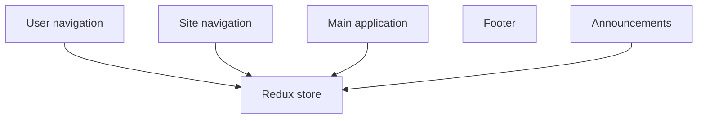

# Application structure

In this doc, we'll go over how VA.gov applications are structured and how they use shared platform code.

## Structure of a page

A typical application page on VA.gov looks something like this:

Each of the areas marked with a red box is a separately mounted React component. These React components shared a common Redux store:

