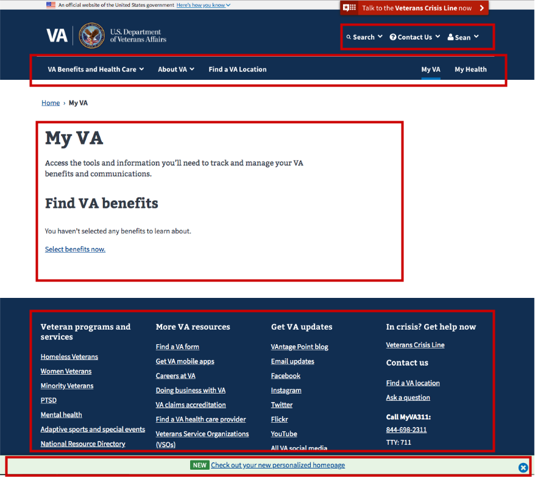
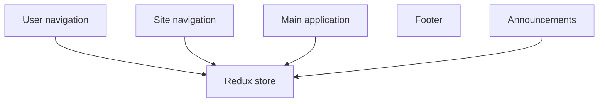
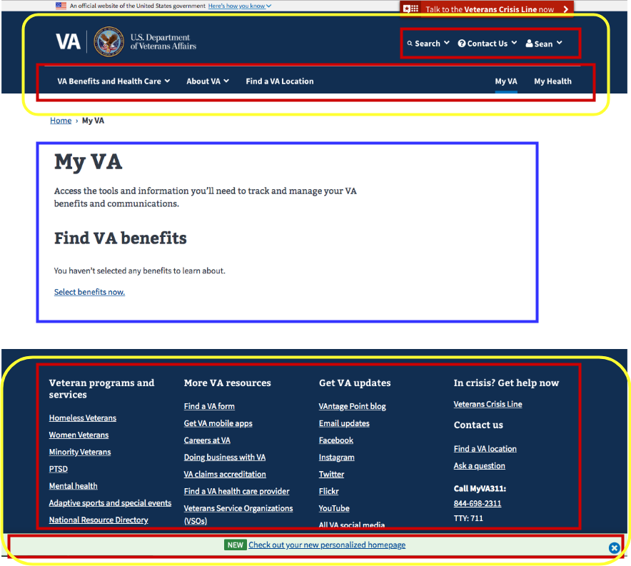

# Page and application Javascript structure

In this doc we'll go over how a page on VA.gov is related to the application code located in vets-website.

## Javascript bundles and static pages

If you look at the source for the `/my-va` page when running locally you'll see a group of three script tags:

```html
<script defer nomodule="" src="/generated/polyfills.entry.js"></script>
<script defer src="/generated/vendor.entry.js"></script>
<script defer src="/generated/dashboard.entry.js"></script>
```

The vendor and polyfills bundles are on every page, but the dashboard bundle is specific to this particular React app. In the source for the `/my-va` page, you'll see this frontmatter:

```md
---
title: My VA
layout: page-react.html
entryname: dashboard
---
```

When this page is built, the `entryname` property tells our build process how to construct the path for the third script tag in the above group. For pages that don't have an `entryname`, the `static-pages` bundle will be used.

In `vets-website`, there will be a manifest.json (or manifest.js) file with a matching entry name. In this case we can search for `entryName: 'dashboard'` and find [src/applications/personalization/dashboard/manifest.js](https://github.com/department-of-veterans-affairs/vets-website/blob/master/src/applications/personalization/dashboard/manifest.js). The `entryFile` property in the manifest will tell you the entry point for this application, the file that Webpack uses as its entry for creating the `dashboard` bundle.

## Structure of a page

A typical application page has several independent React components. Here's an abbreviated screenshot of the `/my-va` page:



Each of the areas marked with a red box is a separately mounted React component. These React components shared a common Redux store:



Static content pages work similarly, except the main content area is not a React component (though it may have one or more React widgets mounted within it).

As we covered in the last section, `/my-va` uses the `dashboard` bundle, the entry file for which is located [here](https://github.com/department-of-veterans-affairs/vets-website/blob/master/src/applications/personalization/dashboard/dashboard-entry.jsx). There's not a lot of code in that file; most of the functionality is abstracted in `startApp`. The dashboard passes in a reducer and routes, which is the primary application. In the [startApp](https://github.com/department-of-veterans-affairs/vets-website/blob/master/src/platform/startup/index.js#L31) function, we create the [common Redux store](https://github.com/department-of-veterans-affairs/vets-website/blob/master/src/platform/startup/index.js#L44), [start the site-wide components](https://github.com/department-of-veterans-affairs/vets-website/blob/master/src/platform/startup/index.js#L64), and [mount the primary React application](https://github.com/department-of-veterans-affairs/vets-website/blob/master/src/platform/startup/index.js#L73):



The components in the yellow boxes are the common site-wide components started by [startSitewideComponents](https://github.com/department-of-veterans-affairs/vets-website/blob/master/src/platform/site-wide/index.js#L26) and the blue box is the primary React application.

## Structure of a React application

Our React applications can vary in structure depending on what their purpose is, but typically they have a reducer and actions for Redux related logic and routes and components for the rest of the application. Routes are typically the best place to start looking at an application. Again using `/my-va` as an example, you can see the React components to start looking at in the [routes.jsx](https://github.com/department-of-veterans-affairs/vets-website/blob/master/src/applications/personalization/dashboard/routes.jsx) file:

```jsx
import DashboardApp from './containers/DashboardApp';
import DashboardAppNew from './containers/DashboardAppNew';
import DashboardAppWrapper from './containers/DashboardAppWrapper';
import SetPreferences from '../preferences/containers/SetPreferences';

import environment from 'platform/utilities/environment';

const component = environment.isProduction() ? DashboardApp : DashboardAppNew;

export const findBenefitsRoute = {
  path: 'find-benefits',
  component: SetPreferences,
  key: 'find-benefits',
  name: 'Find VA benefits',
};

const routes = {
  path: '/',
  component: DashboardAppWrapper,
  indexRoute: { component },
  childRoutes: [findBenefitsRoute],
};

export default routes;
```

There are only two routes in here, but you can see that there's a main `DashboardAppWrapper` component and then a `DashboardApp` component for the main index route.

[DashboardAppWrapper](https://github.com/department-of-veterans-affairs/vets-website/blob/master/src/applications/personalization/dashboard/containers/DashboardAppWrapper.jsx) has some important functionality that's common to a lot of our applications. Here's the render method from that component:

```jsx
render() {
  return (
    <RequiredLoginView
      serviceRequired={[backendServices.USER_PROFILE]}
      user={this.props.user}
    >
      <DowntimeNotification
        appTitle="user dashboard"
        dependencies={[
          externalServices.mvi,
          externalServices.mhv,
          externalServices.appeals,
        ]}
        render={this.renderDowntimeNotification}
      >
        <Breadcrumbs>
          {this.renderBreadcrumbs(this.props.location)}
        </Breadcrumbs>

        {this.props.children}
      </DowntimeNotification>
    </RequiredLoginView>
  );
}
```

Because `/my-va` requires a user to be signed in, we wrap all the child content with `RequiredLoginView`, which makes sure there's a signed in user and directs the user to sign in if not. Also, since the dashboard uses some internal VA services that may be down at times, it also wraps content in a `DowntimeNotifications` component, which will display a message to a user if one of the specified services is down. See the [downtime notifications documentation](/platform/tools/downtime-notifications) for more information.
