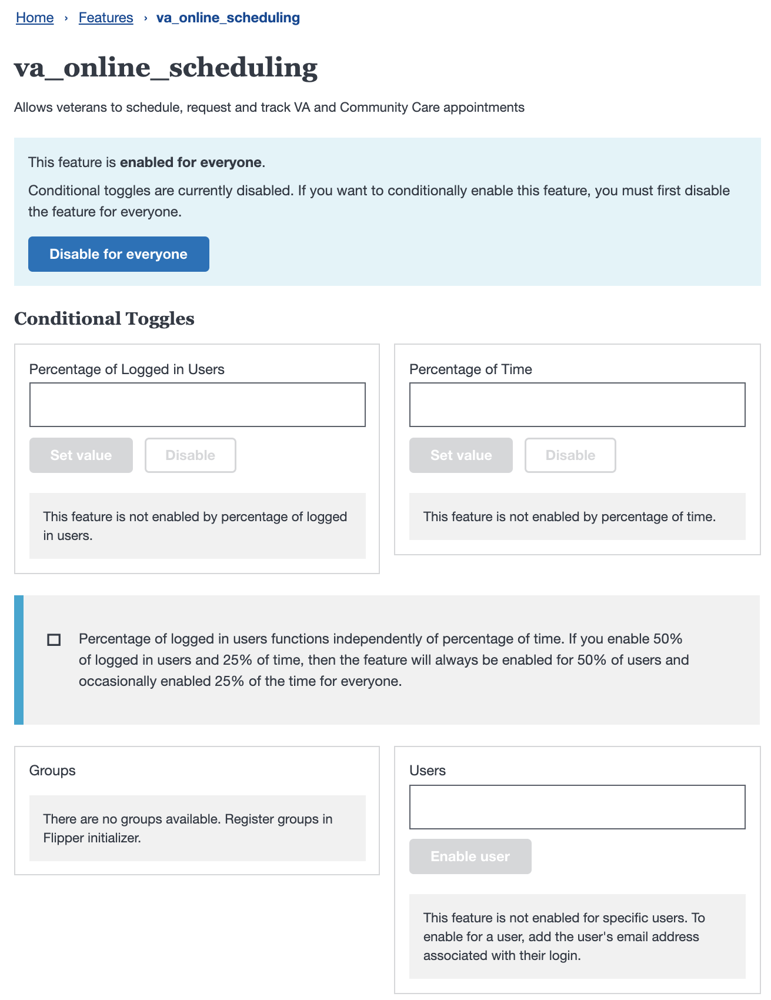

# Front end feature flags

Agile and user centric workflows often use testing of partially complete features to refine or research experiences. This document provides recommendations on using feature flags to manage new unreleased features in our continuous integration environment.

## Enhancements to Existing Applications

**STAGING**: Unreleased features should always be made available on [staging.va.gov](https://staging.va.gov) using [!isProduction()](https://github.com/department-of-veterans-affairs/vets-website/blob/10380007a3ec77047be10e4fb2a42d343c22c5d3/src/platform/utilities/environment/index.js)

**PRODUCTION**: Unreleased features can be made available on www.va.gov by checking [localstorage](https://github.com/department-of-veterans-affairs/vets-website/blob/92811be079cac99884abc28c2c96da61f08fe2a5/src/platform/utilities/storage/localStorage.js) for a developer-defined name/value
   - Turning on the enhancement can be done by adding this name/value to the local storage
      - With a console command ran by the user in the browser, or
      - With application specific code that automatically checks when a certain query parameter is present.

## New Applications

**STAGING**: Unreleased applications should always be made available on [staging.va.gov](https://staging.va.gov) using [!isProduction()](https://github.com/department-of-veterans-affairs/vets-website/blob/10380007a3ec77047be10e4fb2a42d343c22c5d3/src/platform/utilities/environment/index.js)

**PRODUCTION**:
- Unreleased applications can be made available on www.va.gov by checking [localstorage](https://github.com/department-of-veterans-affairs/vets-website/blob/92811be079cac99884abc28c2c96da61f08fe2a5/src/platform/utilities/storage/localStorage.js) for a developer-defined name/value
    - Turning on the application can be done by adding this name/value to the local storage
      - With a console command ran by the user in the browser, or
      - With application specific code that automatically checks when a certain query parameter is present.
- Unreleased applications can be made available on production behind a password by setting `protected: yes` in [react_routes.yml](https://github.com/department-of-veterans-affairs/devops/blob/e1030d1a499e39eaeceb8f4bdcbd33baf7ee946d/ansible/deployment/config/revproxy-vagov/vars/react_routes.yml). External teams should work with their DSVA contact to request support for enabling this.

## New vagov-content pages

Unreleased content pages should always be made available on [staging.va.gov](https://staging.va.gov) by adding an exclusion flag to the front matter of the content page. For example, because this front matter includes `vagovprod: false`, this content page would be excluded from the build for the production environment:

```markdown
---
title: Apply for disability benefits
vagovprod: false
---
<nav aria-label="Breadcrumb" aria-live="polite" class="va-nav-breadcrumbs"
id="va-breadcrumbs">
```

Content pages can be excluded from any or all of these environments:
```markdown
vagovprod: false
vagovstaging: false
vagovdev: false
localhost: false
```

## Writing good feature flags

- New features or applications should be merged often so they can be included as part of the daily continuous integration deploy.
- Feature flagged enhancements should be made with code that is [easy to delete](https://programmingisterrible.com/post/139222674273/write-code-that-is-easy-to-delete-not-easy-to)- ideally done simply and with as few checks as possible. Repeating yourself is okay in feature flagged code.
  - Making code that's easy to delete ensures that deprecated code is quickly removed once a feature is released.
- Making features or applications available in production should done only as needed for testing with users.

## Feature flags for Metalsmith code

Va.gov creates some pages based on content from the VA's Drupal CMS. The CMS has its own content model, which can sometimes change. When those changes modify the existing structure of the content model, the queries and templates in vets-website that expect a different model may break. And because the CMS and vets-website are separate systems with different deployment processes, we can't push up changes in both systems simultaneously. In order to keep the two systems in sync, we need to be able to turn features on and off in vets-website depending on what environment we're in, and update that feature state whenever a cms deployment happens.

We've created some infrastructure to make this a little easier to do.


### Creating a flag and turning it on or off

In src/site/utilities/featureFlags.js, you'll see a list of current flags and their state:

```js
// Edit this to add new flags
const featureFlags = {
  FEATURE1: 'feature1',
};

// Edit this to turn flags on or off
const flagsByBuildtype = {
  // localhost: [],
  localhost: [featureFlags.FEATURE1],
  // vagovdev: [flags.FEATURE1],
  vagovdev: [],
  // vagovstaging: [flags.FEATURE1],
  vagovstaging: [],
  // vagovprod: [flags.FEATURE1],
  vagovprod: [],
};
```

In these two objects, you can create a new feature flag and set which web environments it is turned on in. Whenever you need to change what environment has a particular feature, you would add the flag to the array associate with that build type.

### Using flags in Node code

There are a couple ways to use the flag in Node Javascript code. One way is to use the `applyFeatureFlags` helper in a file that you would like to create a feature flagged variant of:

```js
const someQuery = 'some query info';

module.exports = someQuery;
applyFeatureFlags(module);
```

This helper looks through all of the enabled feature flags and checks to see if there are files with the same name as the current file, but with a feature flag in the file path before the extension.

So, for example, if your file is `healthCarePage.graphql.js` and there's a feature flag called `feature1`, the helper will look for `healthCarePage.graphql.feature1.js`. If `feature1` is turned on, then it will replace the exported module data with the export from the file with the `feature1` suffix.

If you want to make a smaller conditional logic change than creating a whole new file, you can import the featureFlags file and check the flags directly:

```js
const { featureFlags, enabledFeatureFlags } = require('./src/site/utilities/featureFlags');

...

if (enabledFeatureFlags[featureFlags.FEATURE1]) {
  // do something when the flag is on
}
```

Keep in mind the advice in the [Writing good feature flags](#writing-good-feature-flags) section. You should write the logic in a way that is easy to remove later. It's often easier to change some logic and then add a conditional that modifies something with the flag is _not_ enabled. That lets you simply remove the conditional later.

### Using feature flags in Liquid templates

All liquid templates have access to the current feature flag state:

```liquid

  <div>Fancy new feature</div>

```

## Release Toggles 

_This feature is in active development and will replace the current approaches to managing release toggles._ 

### Overview 

- Allows for production toggle switching without redeploying `vets-website`
- Provides a UI for managing feature toggle behavior 
- Provides code helpers for handling common UX scenarios 

### Client behavior 

1. During the build process, feature toggle values are retrieved and included in each of the static html pages. 
2. When the page loads, the feature toggle client retrieves the bootstrapped values from the static html and renders the page using those values.
3. After the page is rendered, the feature toggle client retrieves the latest toggle values from the feature toggle service. 
4. The page is updated using the latest feature toggle values. 

### User experience considerations 

There are a couple ways to do release toggles that each have UX trade offs.

- **Use the bootstrapped values on the initial render**

  - The app will use the values from the static page first and _update_ the markup if the values retrieved from the service are different
  - This works well for content that is not visible on the initial render of the page. Ideally, the update is either not be visible to the user or animates into the view using a simple CSS transition

- **Ignore the bootstrapped values and show a loading state for the feature**

  - The app will show a loading state for the new feature while the toggle values are retrieved from the service 
  - This works well for content that is visible on the initial render of the page. There's no standardized approach; the way this is updated is depdendent on the UX goals. 

### Flipper UI

- Overview of toggle management UI can be found [here](https://github.com/department-of-veterans-affairs/va.gov-team/blob/master/platform/engineering/feature-toggles.md)

### Adding a new feature toggle 

Follow these steps to add and use a new feature toggle to use in `vets-website`

1. Determine your feature toggle name. 

_There are no naming conventions yet. Current examples namespace with the app name first e.g. facilityLocatorShowCommunityCares, profileShowDirectDeposit_

2. Add the feature toggle name to 
 - `vets-website` using camel case: [/src/platform/utilities/feature-toggles/feature-toggle-query-list.json](https://github.com/department-of-veterans-affairs/vets-website/blob/master/src/platform/utilities/feature-toggles/feature-toggle-query-list.json) 

 ```json
{
    "featureToggleQueryList": ["appNameThenYourFeatureName"]
}
 ```

 - `vets-api' using snake case: [config/features.yml](https://github.com/department-of-veterans-affairs/vets-api/blob/master/config/features.yml)

  ```yml
 features:
   app_name_then_your_feature_name:
     description: >
       On https://www.va.gov/find-locations/ enables search box. 
       This toggle is owned by the search team.
  ```

3. Submit a PR for each of these. 

_Crosslinking the PRs in a comment will make it easier for the reviewers to check_ 

4. Run `vet-apis` locally 

_This can be done on master after your PR is merged or off of your feature branch_

5. Navigate to the dev Flipper Admin: [http://localhost:3000/flipper/features](http://localhost:3000/flipper/features)

_See the Flipper admin [documentation](https://github.com/department-of-veterans-affairs/va.gov-team/blob/master/platform/engineering/feature-toggles.md#managing-feature-toggles) for the username / password_

6. Using the **snake case** variant of your feature toggle name, add your feature toggle to the Flipper admin. 

 
 
7. Use the selector helper to build a selector for your feature toggle. For example: 

```js
// import the toggleValues helper
import { toggleValues } from 'platform/site-wide/feature-toggles/selectors';

// use the toggleValues helper to select the toggle values list
export const appNameThenYourFeatureName = state =>
  toggleValues(state).appNameThenYourFeatureName;
```

_The toggleValues object is simply a flat list of toggleName -> boolean key value pairs._

8. Use the feature toggle value to gate your new behavior. For example, you can use the select above in `mapStateToProps` to pass the toggle as a prop into yoru component.

```js
function mapStateToProps(state) {
  return {
    showYourFeatureName:
      appNameThenYourFeatureName(state),
  };
}

...
// inside your connected component

render() {
   const { showYourFeatureName } = this.props;

   return (
     { showYourFeatureName && <NewFeature /> }
   );
}
```

_Currently the feature toggles values are only available on the global redux state._ 

9. Use the Flipper admin to test out the toggle locally. 

  

_Updating the feature toggle state on the website requires refreshing the page. This value can take up to a minute to update in staging and production._

#### Other considerations 

- Each environment has it's own set of feature toggle values. 
- Test your feature toggle in staging before using it in production. 
- Remove release toggles as soon as they are not needed. 
- Make toggles that are easy to delete by gating a behavior in as few places as possible. It's often better to have blocks of repeating code that can be quickly deleted later than it is to gate several small pieces of code 
