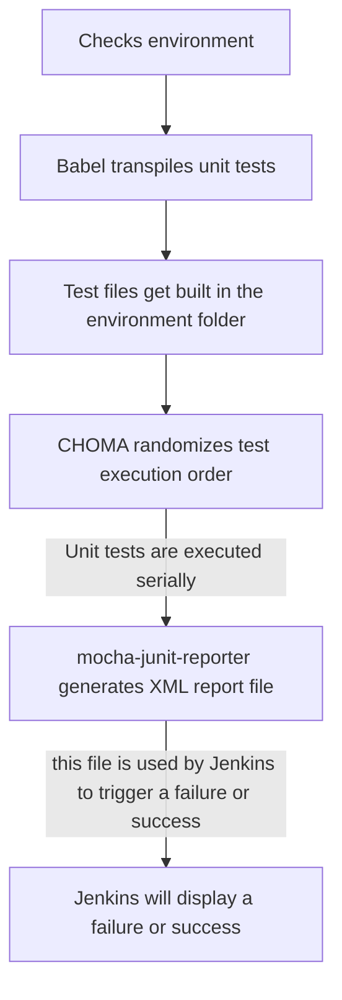

## How do unit tests work?

**File format**: *.unit.spec.js

**Where**: Any *.unit.spec.js file located in the `/src` folder. Typically located in a directory close to the code being tested.

**When**: Locally through npm script commands, Jenkins build (Unit), and After merging to master

** How **: [/getting-started/common-tasks/test](/getting-started/common-tasks/test)

**Process**:

**Libraries used**:

- [mocha.js](https://mochajs.org/): Test framework.
- [chai.js](https://www.chaijs.com/): BDD / TDD assertion library.
- [chai-as-promised](https://github.com/domenic/chai-as-promised): Extends Chai with assertions about promises.
- [sinon.js](https://sinonjs.org/): Standalone test spies, stubs and mocks.
- [enzyme](https://airbnb.io/enzyme/): Enzyme is a JavaScript Testing utility for React that makes it easier to test your React Components' output. You can also manipulate, traverse, and in some ways simulate runtime given the output.
- [enzyme-adapter-react-16](https://www.npmjs.com/package/enzyme-adapter-react-16): Enzyme React 16 integration.
- [react-dom](https://www.npmjs.com/package/react-dom): React DOM Library needed for testing React Components.
- [react-dom/test-utils](https://reactjs.org/docs/test-utils.html): Test utilities for React DOM.
- [react-test-renderer](https://www.npmjs.com/package/react-test-renderer): This package provides an experimental React renderer that can be used to render React components to pure JavaScript objects, without depending on the DOM or a native mobile environment.
- [jsdom](https://airbnb.io/enzyme/docs/guides/jsdom.html): A JavaScript implementation of the WHATWG DOM and HTML standards, for use with node.js.
- [mocha-junit-reporter](https://www.npmjs.com/package/mocha-junit-reporter): Produces JUnit-style XML test results. This is used specifically for Jenkins to trigger a failure or success.
- [choma](https://github.com/lennym/choma): Random execution order for mocha suites.
