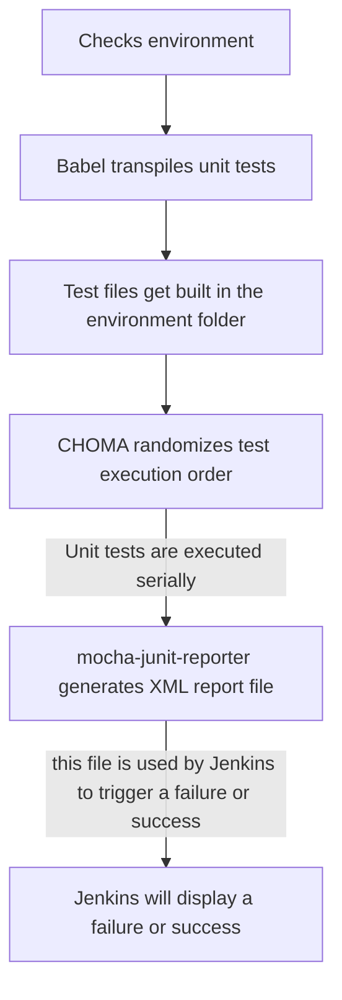

# Unit testing

All new code that is added to `vets-website` should be unit tested. Write unit tests as you build to make sure your form (or other component) is behaving as you expect and to help guard against future bugs. Your test files should go in a `tests` folder in your application folder. 

For example, create a unit test file for each page in a form and then test the following scenarios:

- The correct number of inputs show up when you render the page.
- The correct number of fields display validation errors if you submit without entering any information.
- Any conditional logic on the page displays under the correct conditions.

## Example Unit Test

VSP provides helper utilities to make writing tests easier. The following example illustrates some of these helpers.

You can find this unit test at `src/applications/vic-v2/tests/config/veteranInformation.unit.spec.jsx`:

```js
import React from 'react';
import { expect } from 'chai';
import sinon from 'sinon';
import { mount } from 'enzyme';

import { DefinitionTester, fillData, selectRadio, fillDate } from '../../../../platform/testing/unit/schemaform-utils.jsx';
import formConfig from '../config/form.js';

describe('VIC veteran information', () => {
  const { schema, uiSchema } = formConfig.chapters.veteranInformation.pages.veteranInformation;
  it('should render', () => {
    const form = mount(
      <DefinitionTester
        definitions={formConfig.defaultDefinitions}
        schema={schema}
        data=\{{}}
        uiSchema={uiSchema}
        />
    );

    expect(form.find('input').length).to.equal(7);
    expect(form.find('select').length).to.equal(4);
  });

  ...
});
```

Helpers are imported from `schemaform-utils.jsx`. The most important item in the list is `DefinitionTester`, which is a component you can use to simulate a page being rendered without having to set up a whole form application with all the dependencies.

This unit test uses [Enzyme](http://airbnb.io/enzyme/) and mounts a `DefinitionTester` component that is passed in the schema information from the `veteranInformation` page as props. The test checks to make sure there are 7 `input`s and 4 `select`s on the page. When there are errors with definitions on the form pages, you will often see inputs not being rendered, so this helps check for that scenario.

The next test in the file checks to see that the right fields are marked as required:

```js
  it('should not submit without required info', () => {
    const onSubmit = sinon.spy();
    const form = mount(
      <DefinitionTester
        onSubmit={onSubmit}
        definitions={formConfig.defaultDefinitions}
        schema={schema}
        data=\{{}}
        uiSchema={uiSchema}
        />
    );

    form.find('form').simulate('submit');

    expect(form.find('.usa-input-error').length).to.equal(6);
    expect(onSubmit.called).to.be.false;
  });
```

This test simulates a form submission and then counts the number of error elements on the page, which is expected to be 6. The test checks that the existing validation rules are still generally in place and that additional rules haven't been added.

Finally, this test fills in all the data and submits the form:

```js
  it('should submit with all info filled in', () => {
    const onSubmit = sinon.spy();
    const form = mount(
      <DefinitionTester
        onSubmit={onSubmit}
        definitions={formConfig.defaultDefinitions}
        schema={schema}
        data=\{{}}
        uiSchema={uiSchema}
        />
    );

    fillData(form, 'input#root_veteranFullName_first', 'test');
    fillData(form, 'input#root_veteranFullName_last', 'test2');
    fillData(form, 'input#root_veteranSocialSecurityNumber', '233224343');
    selectRadio(form, 'root_gender', 'F');
    fillDate(form, 'root_veteranDateOfBirth', '1920-01-04');
    fillData(form, 'select#root_serviceBranch', 'F');
    form.find('form').simulate('submit');

    expect(form.find('.usa-input-error').length).to.equal(0);
    expect(onSubmit.called).to.be.true;
  });
```

Helper functions make the correct Enzyme calls to fill in data, so there isn't a lot of repeated code. Those helpers are documented in the `schemaform-utils.jsx` file. At the end, the test checks that no errors are displayed and that the `onSubmit` prop was called, which will only happen if the data passed all the page's validation rules.

Now that you've see these three tests, you should be able to get started writing your own tests. Testing conditional logic works as you might expect, where the helpers fill in data, then check to see that the right number of inputs appear in the page after that change. Some of the tests also directly test logic in `depends` functions on the page configuration.

**File format**: *.unit.spec.js

**Where**: Any *.unit.spec.js file located in the `/src` folder. Typically located in a directory close to the code being tested.

**When**: Locally through npm script commands, Jenkins build (Unit), and After merging to master

** How **: [/getting-started/common-tasks/test](/getting-started/common-tasks/test)

**Process**:



**Libraries used**:

- [mocha.js](https://mochajs.org/): Test framework.
- [chai.js](https://www.chaijs.com/): BDD / TDD assertion library.
- [chai-as-promised](https://github.com/domenic/chai-as-promised): Extends Chai with assertions about promises.
- [sinon.js](https://sinonjs.org/): Standalone test spies, stubs and mocks.
- [enzyme](https://airbnb.io/enzyme/): Enzyme is a JavaScript Testing utility for React that makes it easier to test your React Components' output. You can also manipulate, traverse, and in some ways simulate runtime given the output.
- [enzyme-adapter-react-16](https://www.npmjs.com/package/enzyme-adapter-react-16): Enzyme React 16 integration.
- [react-dom](https://www.npmjs.com/package/react-dom): React DOM Library needed for testing React Components.
- [react-dom/test-utils](https://reactjs.org/docs/test-utils.html): Test utilities for React DOM.
- [react-test-renderer](https://www.npmjs.com/package/react-test-renderer): This package provides an experimental React renderer that can be used to render React components to pure JavaScript objects, without depending on the DOM or a native mobile environment.
- [jsdom](https://airbnb.io/enzyme/docs/guides/jsdom.html): A JavaScript implementation of the WHATWG DOM and HTML standards, for use with node.js.
- [mocha-junit-reporter](https://www.npmjs.com/package/mocha-junit-reporter): Produces JUnit-style XML test results. This is used specifically for Jenkins so it can output and track test results in its system.
- [choma](https://github.com/lennym/choma): Random execution order for mocha suites.
